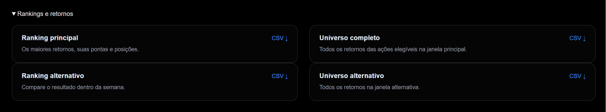
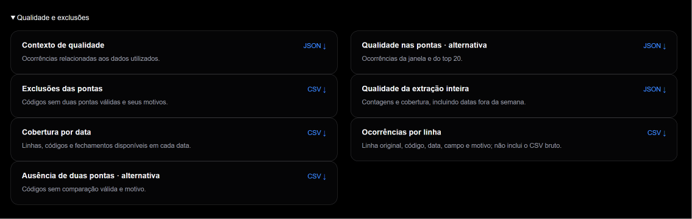
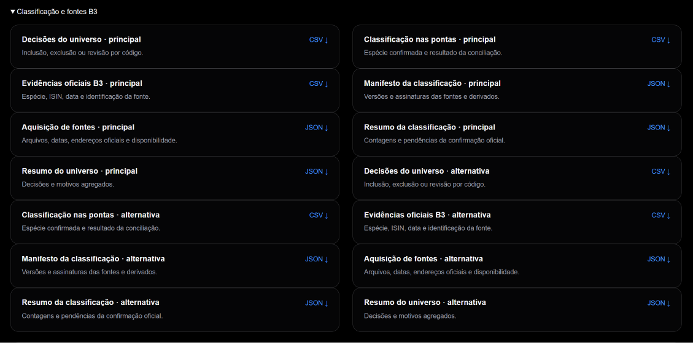
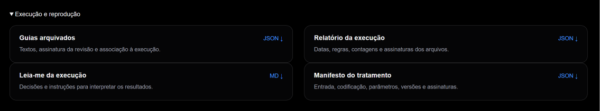
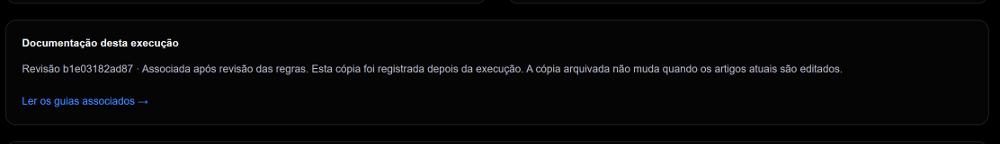

# Auditoria e reprodução

Auditar significa conseguir ligar o resultado à entrada, às regras, às fontes e às decisões que o produziram. As datas e contagens da auditoria pertencem à execução consultada.

## Abra a auditoria da execução

No dashboard, use o acesso à auditoria para consultar datas, universo, alertas e downloads. A referência tem uma auditoria fixa; uma análise enviada tem seu próprio endereço.

Esta documentação apresenta regras gerais. Use os arquivos da execução para conferir seus números, evitando aplicar as contagens do case a outra extração.

## Qual arquivo consultar

Quando o contexto termina, o grupo **Contexto e fontes** oferece quatro JSONs: contexto das empresas, contexto de mercado, manifesto e conferência do contexto. A conferência identifica a cobertura obtida, o modelo, a versão do prompt e as assinaturas dos arquivos usados. Consulte os links das fontes na aba Contexto para ler os documentos de origem. O CSV enviado e a coleta interna não são publicados.

Em novas análises com contexto concluído, esses downloads têm os nomes `context_company.json`, `context_market.json`, `context_manifest.json` e `context_audit.json`. A conferência registra separadamente empresas com acontecimentos da semana até o fechamento e empresas com acontecimentos anteriores; uma empresa pode estar nos dois grupos. Encontrar informação para todas as empresas não significa explicar a causa de todas as altas.

Reproduzir os cálculos financeiros é diferente de gerar um novo texto de IA. Uma coleta nova pode encontrar outras fontes, e o modelo pode escrever de outra maneira. A cópia salva preserva o resultado daquela execução; no ambiente do responsável, as respostas e fontes guardadas permitem reapresentar a mesma geração sem novas consultas. Isso não promete que uma consulta futura produzirá o mesmo texto palavra por palavra.

| Pergunta | Arquivo |
| --- | --- |
| Como chegou às posições? | `top20.csv` e `all_returns.csv` |
| O que muda na outra janela? | `top20_alternativo.csv` e `all_returns_alternativo.csv` |
| Quais volumes entraram na média e quais faltaram? | `volume_context.json` |
| Quais fatos e fontes formaram o contexto de um novo envio? | `context_company.json` e `context_market.json` |
| Qual cobertura, modelo e versão de prompt foram utilizados? | `context_audit.json` |
| O contexto salvo pertence a esta execução e permanece íntegro? | `context_manifest.json` |
| Quais códigos ficaram sem duas pontas? | `candidate_exclusions.csv` |
| Quais instrumentos ficaram fora pelo tipo? | `ranking_universe.csv`: decisão e motivo por código |
| Qual evidência confirmou cada espécie? | `period_classification.csv` e `b3_evidence.csv` |
| Há alertas nos dados usados? | `quality_context.json` |
| Quais problemas existem na extração inteira? | `quality_summary.json`, `quality_by_date.csv` e `quality_issues.csv` |
| Como o tratamento preservou as linhas? | `etl_manifest.json`: entrada, codificação, parâmetros, contagens e assinaturas |
| Quais fontes B3 foram obtidas e usadas? | `source_acquisition.json` e `classification_manifest.json` |
| Quais datas, médias e versões foram utilizadas? | `ranking_report.json` |
| Como interpretar a execução? | `README.md` da execução |

Downloads públicos são limitados a uma lista de derivados permitidos. Classificação, decisões, evidências e aquisição possuem também arquivos com sufixo `_alternativo`, correspondentes à outra janela. Cada análise publica seus próprios derivados. O CSV bruto, a base normalizada completa e os arquivos originais da B3 não são oferecidos publicamente.

O arquivo de exclusões por ausência de preços não substitui o registro de instrumentos excluídos pelo tipo. Na referência, são 158 códigos sem comparação válida e outros 12 instrumentos com preços válidos excluídos pelo universo: nove units e três BDRs. Consulte os registros para outra extração; essas contagens não são fixas.

### Como localizar os downloads na interface

Na auditoria, os arquivos aparecem em quatro grupos recolhíveis. Abra o grupo correspondente ao que deseja conferir. As capturas abaixo mostram a auditoria do case; use os arquivos da execução que você está consultando. Os botões CSV, JSON e MD nas imagens são exemplos visuais; os downloads funcionam na página da auditoria.

#### Rankings e retornos

Use este grupo para baixar o top 20 e todos os retornos das ações elegíveis. Os arquivos principal e alternativo correspondem a datas de comparação próprias.



*“Ranking principal” e “Ranking alternativo” contêm o top 20; “Universo completo” e “Universo alternativo” contêm todos os retornos elegíveis de cada opção.* [Ampliar imagem](assets/arquivos-rankings-20261007.png).

#### Qualidade e exclusões

Use este grupo para descobrir quais códigos ficaram sem preços utilizáveis, quais problemas foram registrados e como a quantidade de dados varia entre as datas.



*“Exclusões das pontas” explica a ausência de comparação válida; “Ocorrências por linha” identifica a linha original, o campo e o motivo. Esses arquivos não oferecem o CSV bruto para download.* [Ampliar imagem](assets/arquivos-qualidade-20261007.png).

#### Classificação e fontes B3

Use este grupo para conferir a decisão de inclusão, exclusão ou revisão de cada código e a evidência oficial que sustenta sua classificação.



*As decisões do universo informam o resultado por código. Os arquivos de evidências e classificação permitem conferir a espécie nas datas utilizadas; aquisição e manifestos registram as fontes, versões e assinaturas.* [Ampliar imagem](assets/arquivos-classificacao-20261007.png).

#### Execução e reprodução

Use este grupo para conferir as datas e regras aplicadas, a identificação dos arquivos e a versão da documentação associada ao resultado.



*“Guias arquivados” permite baixar o registro da documentação. O relatório reúne datas, contagens e assinaturas; o leia-me explica a execução, e o manifesto registra o tratamento da entrada.* [Ampliar imagem](assets/arquivos-execucao-20261007.png).

## Percursos de conferência

### Conferir um retorno

1. Identifique a janela selecionada e suas datas na auditoria.
2. Baixe “Ranking principal” ou “Ranking alternativo” em “Rankings e retornos”.
3. Localize o ticker e confira `start_date`, `end_date`, `start_close` e `end_close`.
4. Calcule `(fechamento final ÷ fechamento inicial − 1) × 100` e compare com `return_pct`, considerando o arredondamento da tela.

No case, ECOM3 compara R$ 1,06 em 11/09 com R$ 1,56 em 18/09: aproximadamente 47,17%. Esse é o retorno individual. Para conferir a média do card, some os 20 valores `return_pct` da mesma janela e divida por 20.

### Entender uma exclusão

1. Procure o código em “Exclusões das pontas”, no grupo “Qualidade e exclusões”: esse arquivo informa a ausência de dois preços utilizáveis.
2. Para instrumentos com preços, consulte “Decisões do universo”, em “Classificação e fontes B3”: ali estão as decisões por tipo e seus motivos.
3. Confira a janela correspondente, pois a data inicial da alternativa é diferente.

Exclusão de um código pode permitir que a análise continue. Uma classificação pendente registrada como revisão impede a conclusão do ranking; veja [as três decisões](classificacao.md#três-decisões-possíveis).

### Investigar um alerta

1. Selecione a ação e leia o campo, a data e o motivo no painel.
2. Abra “Contexto de qualidade” e “Ocorrências por linha” para localizar a ocorrência e a linha original indicada.
3. Compare com seu CSV original, que não é oferecido para download público.
4. Verifique se o campo entra na fórmula e se a ocorrência gera aviso ou bloqueio. Consulte [os efeitos atuais](dados.md#controles-de-qualidade).

Uma linha pode gerar vários alertas, portanto a quantidade de ocorrências não é a quantidade de ações. Os alertas próximos ao ticker consideram as duas datas usadas; a auditoria permite consultar o arquivo mais amplamente.

## Alcance dos alertas

A auditoria permite alternar os detalhes entre janela principal e alternativa. A tabela de qualidade distingue a extração inteira, as duas pontas selecionadas, as ações ON/PN elegíveis e o top 20. As contagens representam ocorrências por campo e linha, não quantidades de ações; uma linha pode gerar vários alertas. Dias intermediários do gráfico não fazem parte da contagem das pontas.

Abra os detalhes para conferir a linha original do CSV e o efeito de cada ocorrência nas ações elegíveis. Ausência ou erro bloqueador no fechamento não é preenchido. Outros campos, como preço médio e volume, não entram na fórmula do retorno. O fechamento entra: um aviso de fechamento fora do mínimo–máximo pode afetar o resultado, embora atualmente não bloqueie sozinho o cálculo. Um aviso provisório de tipo no ETL pode ser resolvido pela confirmação oficial posterior; não indica automaticamente uma classificação pendente.

No case, o preço médio de BIED3 em 18/09 está fora do intervalo diário. O fechamento utilizado no retorno permanece preservado; o preço médio não é usado no cálculo. Isso descreve o alcance do alerta, sem afirmar que o fornecedor está correto ou inventar uma causa.

### Conferir o volume

1. Abra **Conferir dados de volume · JSON** abaixo da tabela diária, ou **Volume diário da semana** no grupo **Rankings e retornos** da auditoria.
2. Em `volume_context.json`, confira `dates`, o ticker em `series` e cada valor de `volume`. Valor `null` indica indisponibilidade; `reason` registra o motivo. `0` é um zero informado.
3. Some os valores válidos e divida pela quantidade deles. Compare com a coluna **VOL. MÉDIO/DIA (R$)**, considerando o arredondamento da tela.
4. Confira também a cobertura. No case, ESTR4 tem média de R$ 1.191,20 em cinco dias; MGEL4 tem quatro de cinco dias válidos. As duas janelas usam os dias da semana para o volume, sem incluir a sexta anterior.

O derivado identifica a entrada, a base normalizada e seu próprio conteúdo por assinaturas. Isso permite conferir a ligação com a execução; não comprova que o volume recebido descreve toda a negociação da B3.

## O que significa hash

Hash SHA-256 é uma assinatura calculada a partir do conteúdo de um arquivo. Se o conteúdo mudar, sua assinatura também muda. Isso permite conferir integridade e identificar qual entrada foi usada. Não demonstra que os dados estejam corretos.

Um manifesto é um registro dos arquivos, parâmetros, versões e assinaturas utilizados em uma etapa. Esses registros permitem identificar o material que produziu o resultado. Para repetir uma execução, preserve a entrada, a configuração, o código e as fontes B3 utilizadas. Uma nova versão de dados ou código pode produzir outro resultado.

A apresentação confere as assinaturas declaradas no relatório e nos manifestos antes de usar as evidências detalhadas, inclusive a correspondência entre tratamento, classificação e aquisição. Os arquivos preservam os nomes internos da pasta de execução; por exemplo, `manifest.json` é publicado como `etl_manifest.json`, e os derivados da outra janela recebem `_alternativo`. Para conferir uma assinatura, use o conteúdo do arquivo baixado. As fontes originais podem ser localizadas pelos endereços oficiais no registro de aquisição.

Uma execução antiga sem os derivados necessários informa que a auditoria detalhada está indisponível; não inventa evidências. As novas análises recebem os detalhes automaticamente. Os derivados continuam acessíveis durante o prazo do resultado, mesmo após a remoção do bruto.

## O que guardar para reproduzir

| Material | Por que conservar | Como obter |
| --- | --- | --- |
| CSV original da Economatica | Contém a entrada exata dos preços | Preserve sua própria cópia; não há download público do bruto |
| Referência e opções aceitas | Determinam a semana e as decisões do envio | Relatório e, quando disponível, `analysis_request.json` |
| Rankings, exclusões e registros de qualidade/classificação | Permitem conferir a saída e as decisões | Downloads da auditoria durante os sete dias |
| Versão do código e parâmetros | Identificam as regras executadas | Relatório, manifestos e repositório |
| Fontes originais B3 utilizadas | Permitem repetir a confirmação oficial | Registros de aquisição e seu cache local; o site não oferece os originais |
| Guias associados | Preservam a explicação vinculada à execução | “Guias arquivados” e “Ler os guias associados” |
| Volume diário e cobertura | Conservam os dados de volume apresentados | `volume_context.json` no dashboard e na auditoria |
| Contexto apresentado e sua conferência | Conservam os textos, referências e identificação da geração | Grupo “Contexto e fontes”, quando a geração estiver concluída |

A URL e um print conservam referências ao resultado, mas não todos os insumos do cálculo. Guarde os derivados antes da expiração e preserve a entrada desde o envio. A obtenção posterior de uma fonte pode trazer outra versão; para comparar execuções, confira também suas assinaturas.

## Conferir, recalcular e reproduzir o contexto

| Objetivo | Material necessário | O que você consegue verificar |
| --- | --- | --- |
| Conferir o resultado apresentado | Rankings, volume, contexto e registros públicos da execução | Números, datas, textos, fontes citadas e integridade dos derivados |
| Repetir os cálculos financeiros | CSV original, fontes B3, referência, opções e código da execução | Datas, elegibilidade, retornos, médias e volume usando as mesmas entradas |
| Reproduzir a geração de contexto sem novas APIs | Pasta completa da execução, incluindo `context/private/`, e a versão correspondente do pipeline e dos prompts | Conteúdo empresarial e de mercado a partir das fontes e respostas guardadas |
| Fazer uma nova coleta de contexto | Nova pasta de execução, configuração e credenciais dos serviços | Uma nova geração, que pode encontrar outras fontes e produzir outra redação |

Os JSONs públicos preservam a leitura apresentada, mas não incluem as respostas completas das APIs nem todos os documentos internos. **Baixar esses JSONs permite conservar e conferir o contexto; sozinho, isso não permite reproduzir a coleta interna.** A pasta `context/private/` fica no ambiente do responsável pela ferramenta e não é oferecida para download.

No ambiente do responsável, `--replay` utiliza as evidências e respostas salvas, grava a comparação em uma pasta própria e não chama as APIs. A versão do código, o prompt e a identificação da apresentação precisam corresponder à geração original. Consulte [os comandos e requisitos técnicos](desenvolvimento.md#contexto-opcional-de-cada-envio). Para conservar essa possibilidade além do prazo do resultado, o responsável precisa guardar a pasta completa antes da remoção.

Uma reprodução igual mostra que o material salvo produz o mesmo conteúdo; não comprova a veracidade de todas as fontes nem a causa da variação de preços. Uma nova geração por API não é esse mesmo teste de reprodução.

## Reproduza pelo Python

Prepare o ambiente conforme [Desenvolvimento](desenvolvimento.md#preparar-o-ambiente): Python 3.11+, repositório e dependências necessárias ao trabalho que será executado. Com o CSV original disponível, rode na raiz do repositório:

```powershell
python weekly_ranking.py --input "CAMINHO\economatica.csv" --reference-date 2026-09-22 --output-dir "runs\reproducao"
```

Substitua os caminhos e a referência pelos da análise e utilize uma pasta de saída própria. Confira a versão do código registrada no resultado que pretende reproduzir. O pipeline busca fontes necessárias que ainda não estejam disponíveis. Adicione `--offline` somente quando todas as fontes necessárias já estiverem guardadas no cache.

Cada linha do ranking contém o retorno individual de uma ação; a média do top 20 aparece no card e no relatório da execução. Gráficos e matriz diária acompanham as datas da janela selecionada. Na alternativa, o primeiro fechamento é o preço inicial: não há retorno diário naquele dia.

Confira datas, elegibilidade e arquivos de retorno antes de comparar duas execuções. Mesmos preços com regras ou datas diferentes não são a mesma análise.

## Versão da documentação

Os artigos são mantidos em Markdown no Git e publicados pelo site. A documentação atual descreve o código revisado; o relatório histórico conserva a identificação do código que executou o case.

Cada nova análise pela interface grava `documentation_snapshot.json` na conclusão: cópia dos artigos e referências técnicas, assinatura SHA-256 da revisão, horário e identificação da entrada e do código. A auditoria permite ler os oito artigos dessa cópia e baixar o registro completo. Uma edição dos guias atuais não reescreve o arquivo da análise.

A associação de uma execução antiga exige revisão e aparece como **associada após revisão**. Ela não significa que os textos já existiam no dia do processamento. A referência de 22/09/2026 recebeu esse tipo de associação. Se não houver registro, o site informa a ausência; não presume que os guias atuais eram os guias históricos.



*“Ler os guias associados” abre a cópia vinculada àquela execução. A revisão b1e03182ad87 identifica a cópia do case mostrada no print, não a versão atual destes artigos. “Associada após revisão” informa que essa cópia foi registrada depois do processamento.* [Ampliar imagem](assets/guias-arquivados-20261007.png).

O registro é conferido antes da leitura: assinaturas e identificação da execução devem coincidir. A assinatura demonstra integridade, não garante que uma explicação esteja correta. O cálculo continua identificado pelo relatório e pelos manifestos. Execuções apenas pelo comando Python podem associar os guias depois da conferência, conforme o [roteiro técnico](desenvolvimento.md). Veja [metodologia](metodologia.md) e [README do projeto](../README.md).

### Registro de um envio pela interface

Novas análises oferecem `analysis_request.json`: referência, assinatura da entrada, datas verificadas e opções. Quando houver aceitação de dados da semana terminando antes da sexta-feira, o arquivo também registra o horário da confirmação. A seção Semana e janelas destaca essa decisão. O registro não inclui nome original, endereço IP nem conteúdo bruto. Sua compatibilidade com o relatório é conferida antes de apresentar o resultado. Análises antigas e execuções pelo comando podem não ter esse arquivo; o relatório continua informando se o encerramento antes da sexta foi aceito.
