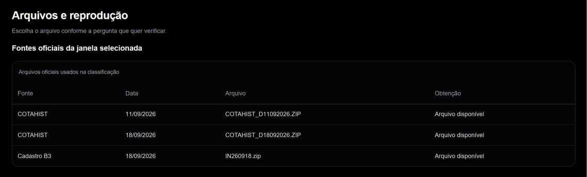

# Classificação dos instrumentos

Esta etapa confirma quais instrumentos com preços disponíveis podem participar do ranking de ações ordinárias (ON) e preferenciais (PN). Chamamos esse conjunto de **universo elegível**. A confirmação utiliza registros oficiais da B3 nas duas datas dos preços comparados.

## Por que o ticker sozinho não basta?

O ticker é o código que identifica o instrumento, como ECOM3. Seu final fornece uma indicação inicial do tipo, chamado espécie nos registros: ON, PN, BDR ou outro produto.

Para códigos completos com quatro caracteres alfanuméricos antes da parte numérica, o projeto utiliza:

| Final | Indicação inicial |
| --- | --- |
| 3 | Ação ordinária (ON) |
| 4 a 8 | Ação preferencial (PN), incluindo classes |
| 31 a 40 | BDR, certificado que representa valores mobiliários de outra empresa |
| Outros formatos | Tipo a verificar; não confirma uma ação ON/PN |

A regra considera o código completo: `B1CS34` segue a faixa de BDR, e `B3SA3` possui uma base alfanumérica válida. Um código terminado em `11` pode corresponder a diferentes produtos; esse final sozinho não confirma uma unit.

**Para incluir uma ação, a indicação do código precisa ser confirmada pelos registros oficiais.** Uma divergência ou falta de confirmação para uma candidata impede a conclusão do ranking até que a situação seja resolvida.

## O que a B3 confirma?

Os registros permitem conferir o tipo de instrumento e sua identificação. Um desses identificadores é o **ISIN**, código que ajuda a distinguir instrumentos mesmo quando há mudanças ou conflitos no ticker.

O sistema consulta arquivos datados da B3:

- **COTAHIST diário:** arquivo histórico de negociações, com informações sobre instrumentos negociados naquela data. Um instrumento sem negociação pode não aparecer nele.
- **Cadastro de instrumentos:** complementa a identificação e a classificação.

Os preços utilizados para calcular o retorno continuam sendo os fechamentos ajustados recebidos da Economatica. A confirmação de ON/PN não valida integralmente cada preço ou a qualidade de todo o arquivo enviado.

## Evidência oficial nas datas

O retorno compara duas datas. Por isso, a confirmação precisa corresponder ao instrumento nessas duas datas; uma identificação de outra época não basta para resolver automaticamente o período solicitado.

*A tabela da auditoria identifica as fontes oficiais consultadas para a janela selecionada. Estas datas pertencem ao case; outra análise usa as fontes necessárias para suas próprias datas. Os preços desses arquivos não substituem os da Economatica.* [Ampliar imagem](assets/fontes-b3-20261007.png).

Arquivos já obtidos são guardados para reutilização, formando um **cache de fontes**. Reutilizar a mesma fonte evita baixá-la e interpretá-la novamente. Quando faltam fontes necessárias e a B3 está indisponível, a análise pode falhar; veja [como proceder](duvidas.md#a-b3-está-indisponível-ou-há-classificação-pendente).

## Três decisões possíveis

| Decisão | O que significa | Efeito na análise |
| --- | --- | --- |
| Incluir | Código ON/PN confirmado nas duas datas, com preços utilizáveis | A ação participa do cálculo |
| Excluir | Instrumento fora do universo ON/PN adotado | O instrumento fica de fora, com motivo registrado; a análise pode continuar |
| Revisar | Candidata sem confirmação ou conflito nos preços duplicados, na identificação ou na espécie | A pendência impede a conclusão do ranking |

**Exemplo:** uma ação ON confirmada nas duas datas pode entrar. Uma unit pode ficar fora porque reúne valores mobiliários e não é uma ação individual ON/PN. Se duas fontes identificarem instrumentos incompatíveis para o mesmo código, o sistema registra revisão; não escolhe uma delas silenciosamente.

BDRs e outros códigos podem ser excluídos pela regra do universo sem uma classificação detalhada de cada produto. Se uma fonte oficial contradizer essa indicação ou identificar uma ação fora do padrão, a situação exige revisão. “Revisar” é uma decisão do processamento; não é um botão para liberar a ação no dashboard.

## Onde conferir a decisão?

Na auditoria da sua análise, abra **“Classificação e fontes B3”**:

- “Decisões do universo” informa inclusão, exclusão ou revisão por código e seu motivo.
- “Classificação nas pontas” informa a espécie nas datas inicial e final.
- “Evidências oficiais B3” apresenta as informações que sustentam a decisão.
- “Aquisição de fontes” identifica os arquivos consultados e sua disponibilidade.

Os arquivos da alternativa têm identificação própria porque sua data inicial pode mudar. Veja [o percurso de conferência](auditoria.md#entender-uma-exclusão).

## Limites da identificação

O projeto atende ao universo brasileiro ON/PN previsto no case. Códigos históricos, trocas de identificação e arquivos de outros mercados podem exigir revisão. A confirmação de um ticker na B3 não deve ser interpretada como garantia de que preços com o mesmo ticker, provenientes de qualquer bolsa, pertencem ao mesmo instrumento. A validação automática dessa correspondência ainda merece atenção.

A quantidade de ações elegíveis depende da entrada e das datas. Não há filtro de liquidez nem promessa de identificar detalhadamente todos os produtos recebidos. Para conferir a implementação, consulte [ranking_universe.py](../ranking_universe.py) e [resolve_period.py](../resolve_period.py).
