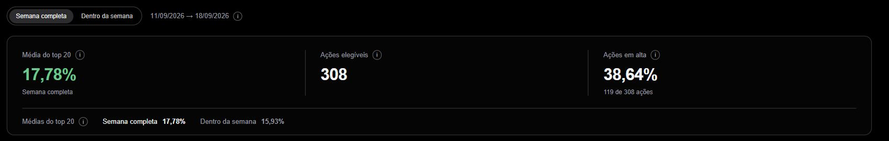
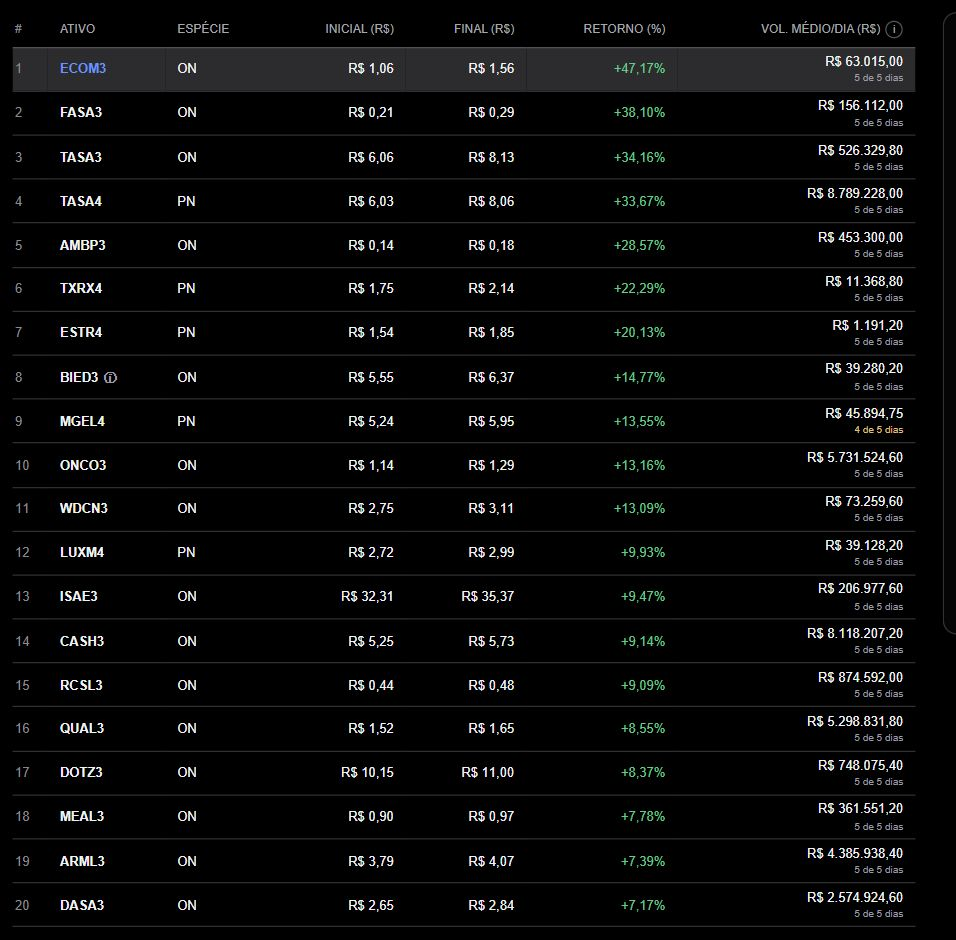
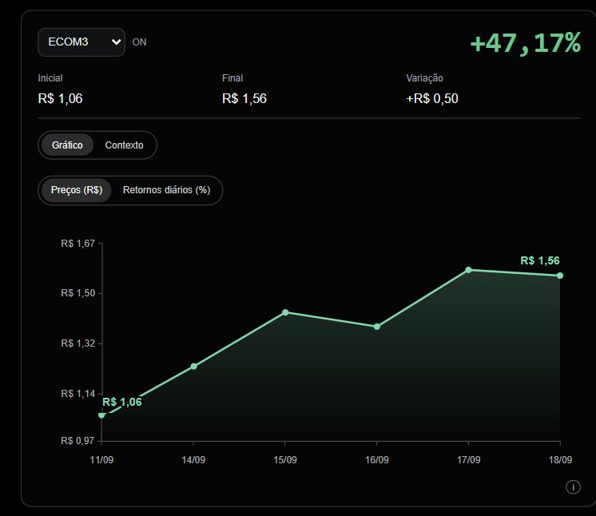
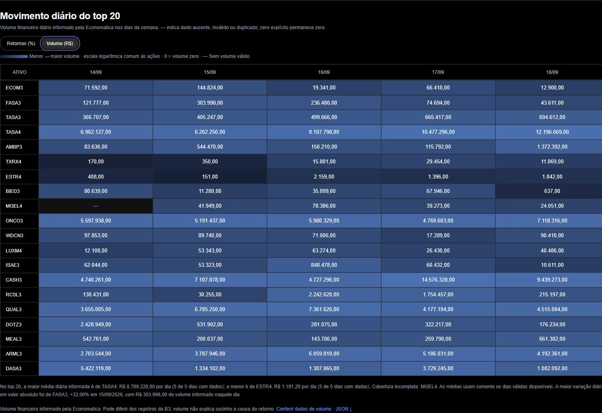
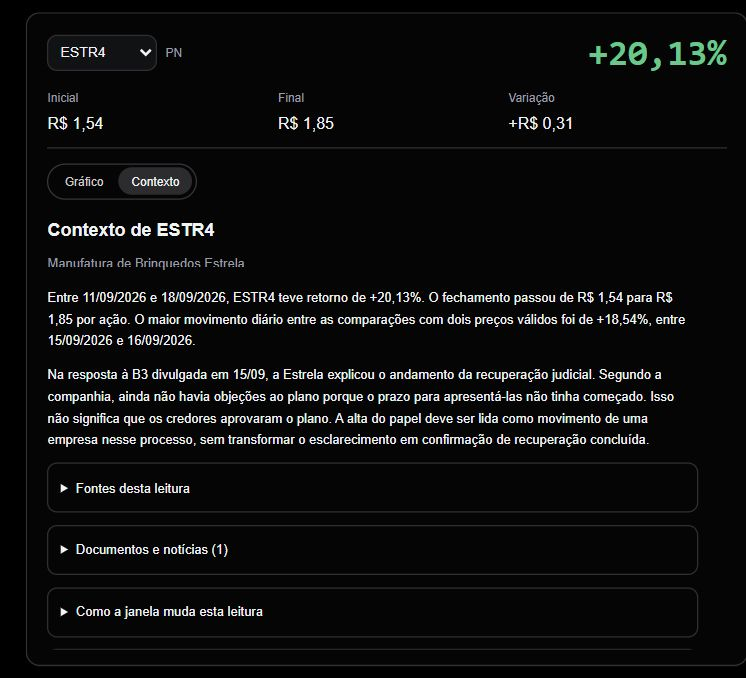
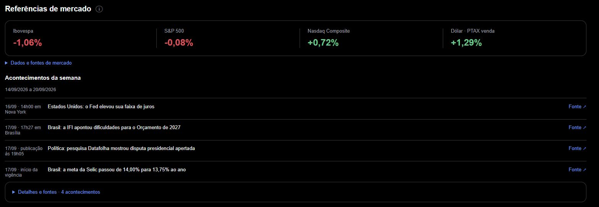
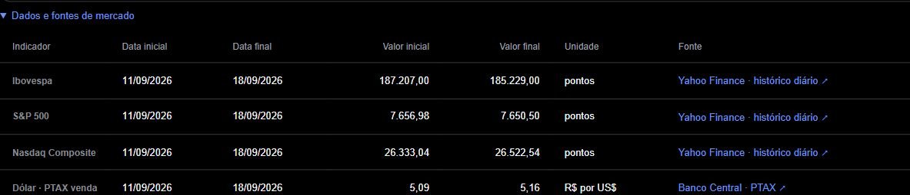
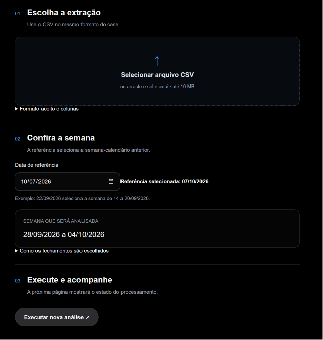
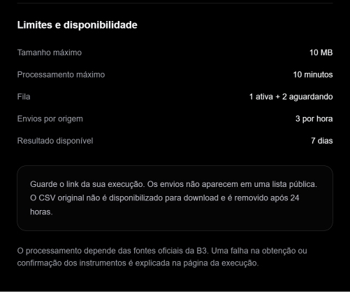

# Como usar o dashboard

O dashboard apresenta os resultados calculados pelo script Python utilizado para a análise. Os controles mudam a visualização e não alteram os preços recebidos ou recalculam o ranking no navegador.

## Leitura do resumo

O seletor **Semana completa | Dentro da semana** fica acima do resumo e define a janela do ranking, dos indicadores e dos gráficos. As datas comparadas aparecem ao lado. As capturas mostram “Semana completa” do case, de **11/09/2026 a 18/09/2026**. Outra análise pode apresentar datas, ações e valores diferentes.

*Os três indicadores acompanham a seleção. A contagem de ações em alta aparece junto à proporção: 119 de 308. A linha inferior compara as médias dos dois rankings e destaca a janela selecionada.* [Ampliar imagem](assets/resumo-seletor-proximo-20261008.jpg).

### Média do top 20

Mostra a média dos retornos das 20 ações apresentadas no ranking: somamos os 20 retornos e dividimos por 20. Cada ação tem o mesmo peso. O valor acompanha a opção selecionada, “Semana completa” ou “Dentro da semana”. Cada linha da tabela mostra o retorno individual de uma ação; o resumo mostra a média do grupo. Os três indicadores têm o mesmo tamanho de fonte; o sinal da média determina sua cor.

### Ações elegíveis

Mostra quantas ações ON e PN puderam participar do ranking na janela selecionada. Para entrar, cada ação precisa ter fechamento válido nas datas inicial e final e classificação confirmada pelos registros oficiais da B3 nessas datas. Essa quantidade inclui todas as ações que atenderam às regras, mesmo aquelas que não ficaram entre as 20 primeiras.

### Ações em alta

Mostra qual porcentagem das ações elegíveis terminou o período com preço maior do que no início. Dividimos a quantidade de ações com retorno positivo pelo total de ações elegíveis. Cada ação é contada uma vez, independentemente do tamanho da alta. Esse percentual acompanha a janela selecionada.

### Comparação das médias

Uma linha abaixo dos indicadores mostra as médias de **Semana completa** e **Dentro da semana**, sem um quarto card. A alternativa mede os retornos a partir do fechamento do primeiro dia disponível dentro da semana. No case, compara 14/09 com 18/09. A mudança até o fechamento de 14/09 fica de fora porque esse preço é o ponto inicial. As duas opções analisam a mesma semana anterior e terminam na mesma data.

Cada janela possui seu próprio ranking e pode selecionar ações diferentes. A diferença entre suas médias não isola o efeito do primeiro pregão.

Os ícones de informação exibem explicações ao passar o mouse ou receber foco pelo teclado. No celular, toque para abrir ou fechar; tocar fora também fecha a explicação. Para entender como são escolhidas as datas, quais ações podem participar e como são calculados os retornos e a média, consulte a [Metodologia do ranking](metodologia.md).

Os percentuais do resumo usam duas casas decimais e a quantidade de ações permanece inteira. Na janela “Semana completa” do case, por exemplo, 119 de 308 ações tiveram retorno positivo, o que representa **38,64% do total de ações elegíveis**.

**Semana completa:** usa o fechamento antes de a semana começar e o último disponível nela. Na referência, compara o preço no fim de 11/09 com o preço no fim de 18/09; assim, inclui também a mudança do primeiro dia com dados, 14/09. **Dentro da semana:** começa no preço ao fim de 14/09 e termina ao fim de 18/09. A mudança até o fechamento de 14/09 fica de fora, pois esse fechamento já é o ponto de partida. As duas opções terminam na mesma data da semana anterior; a alternativa não acompanha os dados até o dia atual. Os textos de informação mostram as datas da execução consultada.

## Explore uma ação

O painel tem as abas **Gráfico** e **Contexto**. Elas ocupam a mesma área: trocar de aba mantém o ticker, os preços e o retorno selecionados. O contexto oferece fatos sobre a empresa, resultados financeiros disponíveis até o fechamento, acontecimentos datados e links para as fontes. Trocar de ação ou janela atualiza a leitura dos preços e das datas.

Em um novo envio, o ranking aparece primeiro. A aba Contexto informa enquanto a coleta está em andamento e atualiza automaticamente quando ela termina. Se uma fonte ou serviço falhar, o ranking permanece disponível. Uma mensagem informa o limite encontrado; falta de notícia confirmada não significa que nenhuma notícia existiu.

Leia também o tipo de informação disponível. **Antecedentes financeiros** descrevem um trimestre anterior, com suas datas. **Documentos institucionais**, como estatuto e política de riscos, descrevem regras e atividades: seu registro na semana não comprova uma mudança no negócio. Nenhum desses casos deve ser confundido com uma notícia que explique a oscilação do preço.

Os novos envios combinam resumos financeiros produzidos em Python e leituras por IA. Identidade, datas e trechos das fontes recebem conferência automática; propostas de acontecimentos válidas passam por uma segunda leitura por IA. Os novos textos não recebem revisão humana individual. O case possui textos preparados e revisados separadamente. Em ambos, os fatos dão contexto, mas não comprovam que uma notícia causou cada alta ou queda. Informações posteriores ao último fechamento recebem aviso próprio.

No desktop, a tabela apresenta estas colunas:

| Coluna | Significado |
| --- | --- |
| # | Posição no ranking, ordenado do maior retorno para o menor |
| ATIVO | Código da ação, chamado ticker |
| ESPÉCIE | ON: ação ordinária; PN: ação preferencial |
| INICIAL (R$) | Fechamento na data inicial da janela selecionada |
| FINAL (R$) | Fechamento na data final |
| RETORNO (%) | Variação percentual entre esses dois fechamentos |
| VOL. MÉDIO/DIA (R$) | Soma do volume financeiro informado na semana dividida pelos dias com volume válido; abaixo do valor aparece a cobertura |

*A linha cinza indica ECOM3 selecionada. A última coluna mostra o volume médio diário e a cobertura: MGEL4 tem quatro dos cinco dias válidos. A marca junto a BIED3 indica um alerta nos dados.* [Ampliar imagem](assets/ranking-volume-reais-20261008.jpg).

Selecione uma linha do ranking ou escolha o ticker no seletor junto ao gráfico. Essa seleção atualiza o painel e o gráfico para a ação escolhida. O painel apresenta o ticker, a espécie, o retorno do período, os fechamentos inicial e final, a diferença em reais por ação e eventuais alertas.

No desktop, o painel permanece visível ao lado da tabela, que inclui o volume médio diário em reais e sua cobertura. No celular, a tabela mostra posição, ticker e retorno; selecionar uma linha atualiza a ação e leva a página até o painel. O volume permanece disponível na tabela diária. Use “Voltar ao ranking” para retornar à tabela.

*ECOM3 passou de R$ 1,06 para R$ 1,56: aumento de R$ 0,50 por ação, equivalente a 47,17% sobre o preço inicial. Use as abas para alternar entre o gráfico e o contexto da mesma ação.* [Ampliar imagem](assets/painel-ecom3-20261008.jpg).

- **Preços (R$):** fechamentos observados em reais por ação, somente entre o início e o fim da janela selecionada.
- **Retornos diários (%):** variações entre datas consecutivas da extração dentro da janela selecionada. Na alternativa, o primeiro dia aparece como “—”: seu fechamento é o preço inicial, e o primeiro retorno aparece na próxima data da extração com comparação válida.
- **Passar o mouse ou focar os pontos pelo teclado:** detalhes do valor e da data; para um retorno, aparecem as duas datas comparadas. No dispositivo móvel, toque na região da observação; o valor aparece abaixo do gráfico.
- **Valores nas extremidades:** preços inicial e final da série exibida no modo de preços.

Uma lacuna na linha do gráfico de preços indica que não há fechamento utilizável naquela data. No gráfico de retornos diários, “—” indica que não foi possível comparar dois fechamentos consecutivos. Essas ausências não representam retorno zero, e a ferramenta não preenche os preços faltantes.

Na alternativa, o primeiro dia também mostra “—”, mas por outro motivo: seu fechamento é o preço inicial da janela. Ainda não existe uma comparação dentro dela. A explicação da observação identifica esse motivo. Veja [por que podem faltar dados](duvidas.md).

## Compare o contexto

### Volume do top 20

Na tabela “Movimento diário do top 20”, alterne entre **Retornos (%)** e
**Volume (R$)**. O modo de volume mostra o valor informado pela Economatica
em cada dia da semana. A intensidade do azul aumenta com o volume, usando
a mesma escala logarítmica para todas as ações e datas exibidas. Isso permite distinguir volumes de magnitudes diferentes: diferenças iguais de cor não representam diferenças iguais em reais. Zero explícito tem fundo neutro; ausência permanece marcada com “—”. Verde e vermelho continuam exclusivos
dos retornos. Na alternativa, o primeiro dia pode ter volume mesmo sem retorno:
pode haver um volume informado naquele dia, inclusive zero, mas seu fechamento é o início do cálculo.

A coluna **VOL. MÉDIO/DIA (R$)** calcula uma média dentro daquela semana,
não entre várias semanas. “4 de 5 dias” significa quatro valores válidos
entre cinco datas com fechamentos positivos observadas na extração.
Zero explícito entra na média. Ausências, valores inválidos e registros
duplicados não entram; a cobertura incompleta permanece indicada.
Os dois modos usam os dias dentro da semana, sem incluir o volume da
sexta-feira anterior que serve de base para o retorno principal.

A cobertura aparece abaixo de cada média no ranking. Uma média parcial exige atenção ao comparar ações.
O volume descreve a negociação registrada; não prova a causa da alta ou queda.
Os valores recebidos podem diferir dos registros da B3 e não são substituídos
por eles. Use **Conferir dados de volume · JSON** para guardar o derivado
da mesma execução. Resultados antigos sem esse derivado mostram indisponibilidade.

*Cada célula mostra o volume financeiro recebido para a ação e a data. MGEL4 em 14/09 aparece como “—”. A média diária de ESTR4 é R$ 1.191,20, usando os cinco dias; a de TASA4 é R$ 8.789.228,00. O “i” junto ao título explica a escala logarítmica; as diferenças descrevem os valores da extração, sem explicar por si só as altas.* [Ampliar imagem](assets/volume-diario-20261008-log.jpg).

### Contexto da ação selecionada

Abra **Contexto** no painel da ação. A leitura começa pelos preços e pelo retorno da janela escolhida; depois apresenta os fatos encontrados sobre a empresa. Expanda **Documentos e notícias** para consultar datas, descrições e links. **Fontes desta leitura** identifica os documentos usados no resumo. Quando há lacunas identificadas, **O que ainda não conseguimos confirmar** informa essa limitação.

*A aba mantém ESTR4 selecionada e seu retorno de 20,13%. O texto descreve o esclarecimento da empresa sobre a recuperação judicial; não transforma esse documento em prova de que causou a alta.* [Ampliar imagem](assets/contexto-estr4-20261008.jpg).

Um acontecimento pode ter ocorrido na semana ou antes dela. Resultados trimestrais são antecedentes financeiros: ajudam a entender a situação da empresa, mas se referem ao período indicado no documento. A coleta não promete uma notícia para cada ação em cada dia. Se nenhuma evidência suficiente for confirmada, a leitura informa essa limitação.

### Referências de mercado e acontecimentos

A seção **Referências de mercado**, entre o resumo e “20 Maiores retornos da semana”, compara Ibovespa, S&P 500, Nasdaq Composite e dólar PTAX nas datas da janela selecionada. Uma faixa compacta mostra as variações. O período fica junto ao seletor de semana; datas diferentes aparecem junto ao indicador correspondente. **Dados e fontes de mercado** abre uma tabela com indicador, datas inicial e final, valores inicial e final, unidade e fonte. No celular, deslize dentro da tabela para consultar as colunas. O “i” explica o método e as diferenças entre as referências. PTAX é a taxa de referência do Banco Central; não é fechamento de mercado. Essas referências não substituem os preços da Economatica.

*A seção mostra todos os títulos de acontecimentos confirmados, na ordem da coleta, com data e link para a fonte. Abra “Detalhes e fontes” para ler os textos completos dos mesmos acontecimentos. Sem fatos confirmados, a lista não ocupa o topo; limites da busca ficam em “Cobertura dos acontecimentos”, quando disponíveis. Os fatos dão contexto, sem comprovar a causa de cada retorno.* [Ampliar imagem](assets/referencias-quatro-acontecimentos-20261008.jpg).

*Os valores inicial e final usam a unidade indicada em cada linha.* [Ampliar imagem](assets/fontes-mercado-tabela-20261008.jpg).

Trocar a janela atualiza as comparações de preços. Isso não muda a data de publicação de uma notícia nem faz um antecedente passar a ser um acontecimento da semana.

No dashboard, a tabela de movimentos diários vem depois do ranking e do gráfico da ação. “Além do top 20” aparece por último e reúne a distribuição dos retornos e a contagem de ações em alta, em baixa e estáveis.

### Movimento diário do top 20

Cada linha representa uma ação do top 20; cada coluna representa uma data. O percentual compara o fechamento daquela data com o da data anterior da extração. Verde indica alta; vermelho indica queda.

*Na opção “Semana completa”, a coluna de 14/09 compara os fechamentos de 11/09 e 14/09. As demais colunas comparam datas consecutivas da extração.* [Ampliar imagem](assets/movimento-diario-20261007.png).

**0,00% e “—” têm significados diferentes:** AMBP3 em 14/09 mostra 0,00% porque os dois fechamentos eram iguais. MGEL4 em 14/09 e 15/09 mostra “—” porque não havia dois preços utilizáveis para a comparação; dados ausentes ou conflitantes não são preenchidos.

Na alternativa “Dentro da semana”, o primeiro dia mostra “—” por outro motivo: seu fechamento é o preço inicial. A primeira variação aparece na data seguinte com comparação válida. A captura acima mostra a opção “Semana completa”, não a alternativa.

No celular, deslize dentro da tabela para consultar as datas e ações; ticker e cabeçalhos permanecem fixos. Tocar no ticker seleciona a ação e leva você ao seu painel. A descrição de cada célula informa as datas comparadas ou o motivo da ausência. O retorno semanal compara os fechamentos inicial e final; não é a soma dos percentuais diários.

### Distribuição dos retornos

Agrupa os retornos **semanais de todas as ações elegíveis** por faixa percentual. O número à direita informa quantas ações ficaram em cada faixa; a barra permite comparar essas quantidades. Não são apenas as 20 ações do ranking, nem os retornos diários.

*As seis faixas somam 308 ações elegíveis. A maior concentração está na faixa de −10% a 0%.* [Ampliar imagem](assets/distribuicao-20261007.png).

### Ações em alta, em baixa e estáveis

Conta quantas ações elegíveis terminaram a janela com fechamento maior, menor ou igual ao inicial. A barra mostra a proporção de cada grupo nessa amostra; não representa todo o mercado.

*119 + 181 + 8 = 308 ações. As 119 em alta representam 38,64% das elegíveis, o mesmo percentual do card “Ações em alta”.* [Ampliar imagem](assets/amplitude-20261007.png).

## Baixe e confira

O link ao lado de “Maiores retornos da semana” baixa o ranking da janela exibida. A auditoria da execução reúne os demais arquivos permitidos, as datas e os alertas. Guarde o endereço web (URL) da sua análise e baixe os arquivos que quiser conservar nos sete dias de disponibilidade. O case continua na página inicial; um novo envio não o substitui.

## Envie outra extração

1. Abra [Nova análise](/nova-analise) e selecione um CSV de até 10 MB.
2. Confira a data de referência e a semana indicada. A referência define a semana-calendário anterior.
3. Envie e acompanhe a etapa do processamento.
4. Ao concluir, explore o resultado e abra sua auditoria. Se falhar, leia o motivo antes de tentar novamente.

*Siga as três etapas: selecione o CSV, confira a referência e a semana e execute a análise. Nesta captura, o campo de data está em formato mês/dia/ano; a confirmação ao lado apresenta a referência como 07/10/2026 (7 de outubro), que seleciona a semana de 28/09 a 04/10. São datas diferentes das do case. O card mostra a semana-calendário; os fechamentos utilizados no cálculo serão definidos pelos dados do CSV. Após conferir, use “Executar nova análise” para seguir à página de acompanhamento.* [Ampliar imagem](assets/nova-analise-formulario-20261007.png).

### Limites e disponibilidade da nova análise

O arquivo deve ter até **10 MB**, e cada análise tem um limite de **dez minutos de processamento**, contado após começar a ser executada. A fila aceita uma análise em processamento e até duas aguardando; a mesma origem de acesso pode criar até três análises por hora. A obtenção e a confirmação das fontes oficiais da B3 também podem interromper a análise, com o motivo apresentado na página de acompanhamento.

*Guarde o endereço web (URL) da sua análise: os envios não aparecem em uma lista pública. Baixe os resultados que quiser conservar durante os sete dias de disponibilidade.* [Ampliar imagem](assets/nova-analise-limites-20261007.png).

O resultado de teste fica disponível por sete dias. O CSV bruto é removido após 24 horas e não é oferecido para download. Consulte [formato e tratamento](dados.md) antes de enviar outro esquema.

### Se a semana terminar antes de sexta-feira

O primeiro envio abrirá uma revisão no próprio formulário, sem criar análise nem guardar o CSV dessa tentativa. Confira as datas e a extração original. A ausência pode ser feriado ou arquivo incompleto; o site não decide a causa. Se você aceitar essas datas, marque a confirmação e execute novamente. A auditoria e o registro do envio mostrarão a decisão. Alterar arquivo ou referência exige nova revisão. Uma cobertura insuficiente impede continuar.

Se a análise falhar depois disso, a página apresenta o motivo e a orientação aplicável. A confirmação não substitui a classificação B3 nem corrige preços.

## Navegação no celular

Abra o menu principal pelo botão de três linhas. Na documentação, “Assuntos” escolhe o artigo e “Nesta página” abre seu índice; as setas indicam abertura e fechamento. Os controles continuam acessíveis durante a leitura. Na auditoria, use o seletor de seção e consulte os arquivos agrupados em rankings, qualidade, classificação e reprodução. A tela cheia permanece disponível no desktop e é ocultada no mobile.

## Interprete os destaques e a variação em reais

O ranking acompanha a janela escolhida. Os retornos aparecem na tabela; preços, variação em reais e alertas ficam no painel da ação selecionada.

O painel da ação mostra os fechamentos inicial e final e a diferença **final − inicial**, em reais por ação ajustada, calculada em Python com precisão decimal. A diferença não é lucro de uma operação: não considera custos nem uma quantidade negociada. Valores pequenos podem aparecer com até seis casas na interface; os preços exatos permanecem nos CSVs auditados. A variação absoluta não muda a ordenação por retorno percentual.

A marca de informação no ticker indica um alerta da janela selecionada. Ao selecionar a ação, o painel mostra data, campo, motivo e se o campo entra na fórmula. Esses alertas consideram as duas pontas; não garantem ausência de problemas nos dias intermediários. A auditoria contém o contexto mais amplo.

**Exemplo de alerta:** em BIED3, o preço médio recebido em 18/09 ficou fora do mínimo e do máximo informados para o dia. Isso merece conferência no CSV, mas não prova que o fechamento esteja errado. O ranking usa os fechamentos de R$ 5,55 e R$ 6,37: a diferença é R$ 0,82 por ação ajustada, e o retorno é 14,77%. O preço médio não entra nessa fórmula.

O volume financeiro e a quantidade ajustada podem usar bases diferentes. A interface apresenta o volume recebido e sua cobertura, mas não calcula um indicador que prometa facilidade de compra ou venda. Nenhum filtro de liquidez foi aplicado.
