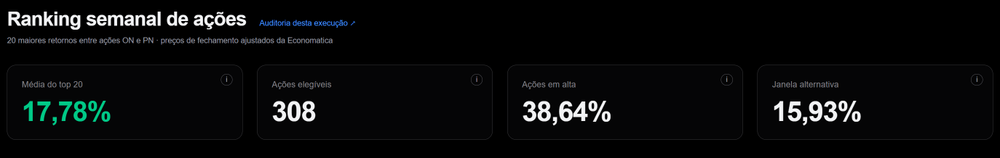
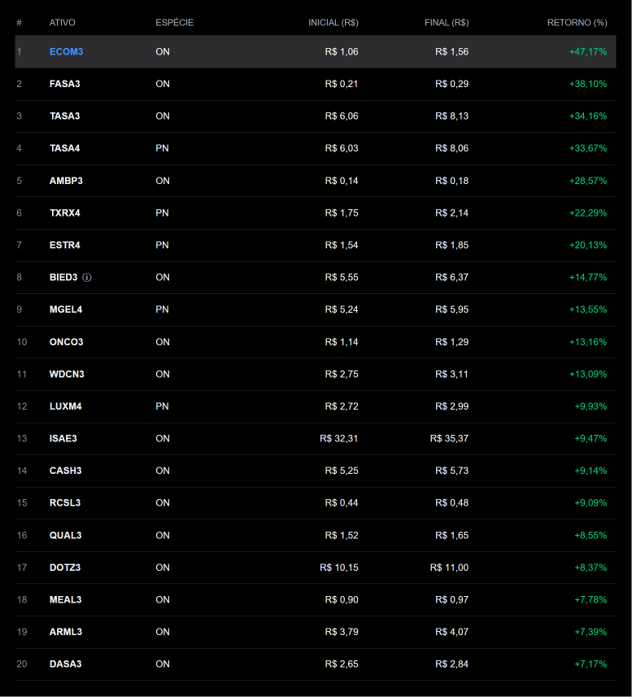
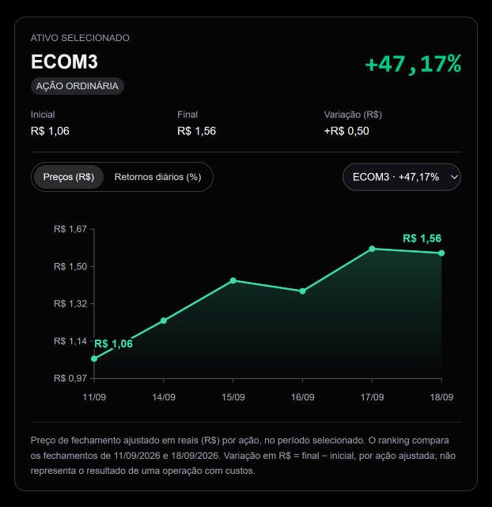
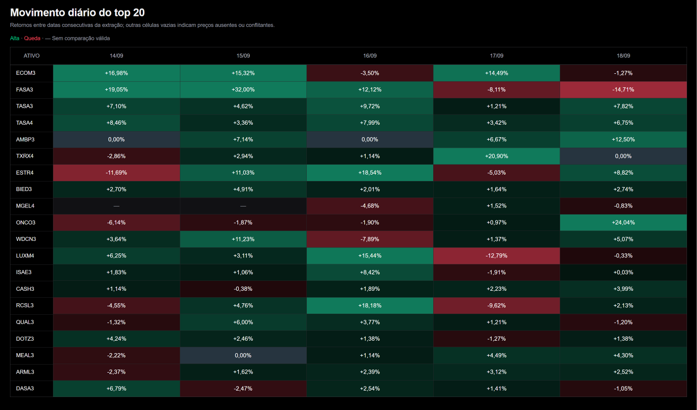
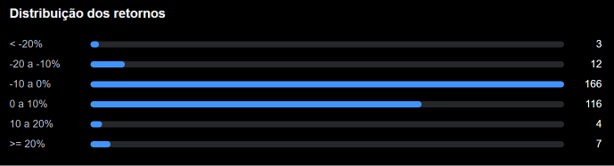
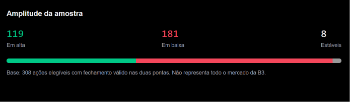

# Como usar o dashboard

O dashboard apresenta os resultados calculados pelo script Python utilizado para a análise. Os controles mudam a visualização e não alteram os preços recebidos ou recalculam o ranking no navegador.

## Leitura dos cards

As capturas deste artigo mostram a janela “Semana completa” do case, com comparação de **11/09/2026 a 18/09/2026**. Outra análise pode apresentar datas, ações e valores diferentes.

*Os três primeiros cards mostram a opção selecionada; o último mostra a média da alternativa.* [Ver imagem em tamanho original](assets/cards-20261007.png).

### Média do top 20

Mostra a média dos retornos das 20 ações apresentadas no ranking: somamos os 20 retornos e dividimos por 20. Cada ação tem o mesmo peso. O valor acompanha a opção selecionada, “Semana completa” ou “Dentro da semana”. Cada linha da tabela mostra o retorno individual de uma ação; este card mostra a média do grupo.

### Ações elegíveis

Mostra quantas ações ON e PN puderam participar do ranking na janela selecionada. Para entrar, cada ação precisa ter fechamento válido nas datas inicial e final e classificação confirmada pelos registros oficiais da B3 nessas datas. Essa quantidade inclui todas as ações que atenderam às regras, mesmo aquelas que não ficaram entre as 20 primeiras.

### Ações em alta

Mostra qual porcentagem das ações elegíveis terminou o período com preço maior do que no início. Dividimos a quantidade de ações com retorno positivo pelo total de ações elegíveis. Cada ação é contada uma vez, independentemente do tamanho da alta. Esse percentual acompanha a janela selecionada.

### Janela alternativa

Mostra a média dos 20 maiores retornos medidos a partir do fechamento do primeiro dia disponível dentro da semana. No case, compara os preços de 14/09 com os de 18/09. A mudança ocorrida até o fechamento de 14/09 fica de fora porque esse preço é o ponto inicial. A alternativa analisa a mesma semana anterior e termina na mesma data da opção “Semana completa”.

Os três primeiros cards acompanham a janela selecionada. O card “Janela alternativa” sempre mostra a média da alternativa.

Os ícones de informação exibem explicações ao passar o mouse ou receber foco pelo teclado. No celular, toque para abrir ou fechar; tocar fora também fecha a explicação. Para entender como são escolhidas as datas, quais ações podem participar e como são calculados os retornos e a média, consulte a [Metodologia do ranking](metodologia.md).

Os percentuais dos cards usam duas casas decimais e a quantidade de ações permanece inteira. Na janela “Semana completa” do case, por exemplo, 119 de 308 ações tiveram retorno positivo, o que representa **38,64% do total de ações elegíveis**.

**Semana completa:** usa o fechamento antes de a semana começar e o último disponível nela. Na referência, compara o preço no fim de 11/09 com o preço no fim de 18/09; assim, inclui também a mudança do primeiro dia com dados, 14/09. **Dentro da semana:** começa no preço ao fim de 14/09 e termina ao fim de 18/09. A mudança até o fechamento de 14/09 fica de fora, pois esse fechamento já é o ponto de partida. As duas opções terminam na mesma data da semana anterior; a alternativa não acompanha os dados até o dia atual. Os textos de informação mostram as datas da execução consultada.

## Explore uma ação

No desktop, a tabela apresenta estas colunas:

| Coluna | Significado |
| --- | --- |
| # | Posição no ranking, ordenado do maior retorno para o menor |
| ATIVO | Código da ação, chamado ticker |
| ESPÉCIE | ON: ação ordinária; PN: ação preferencial |
| INICIAL (R$) | Fechamento na data inicial da janela selecionada |
| FINAL (R$) | Fechamento na data final |
| RETORNO (%) | Variação percentual entre esses dois fechamentos |

*A linha cinza indica a ação selecionada, ECOM3 neste exemplo. A marca de informação junto a BIED3 indica um alerta nos dados.* [Ver imagem em tamanho original](assets/ranking-20261007.png).

Selecione uma linha do ranking ou escolha o ticker no seletor junto ao gráfico. Essa seleção atualiza o painel e o gráfico para a ação escolhida. O painel apresenta o ticker, a espécie, o retorno do período, os fechamentos inicial e final, a diferença em reais por ação e eventuais alertas.

No desktop, o painel permanece visível ao lado da tabela. No celular, a tabela prioriza posição, ticker e retorno; selecionar uma linha atualiza a ação e leva a página até o painel. Use “Voltar ao ranking” para retornar à tabela.

*ECOM3 passou de R$ 1,06 para R$ 1,56: aumento de R$ 0,50 por ação, equivalente a 47,17% sobre o preço inicial.* [Ver imagem em tamanho original](assets/painel-ecom3-20261007.png).

- **Preços (R$):** fechamentos observados em reais por ação, somente entre o início e o fim da janela selecionada.
- **Retornos diários (%):** variações entre datas consecutivas da extração dentro da janela selecionada. Na alternativa, o primeiro dia aparece como “—”: seu fechamento é o preço inicial, e o primeiro retorno aparece na próxima data da extração com comparação válida.
- **Passar o mouse ou focar os pontos pelo teclado:** detalhes do valor e da data; para um retorno, aparecem as duas datas comparadas. No dispositivo móvel, toque na região da observação; o valor aparece abaixo do gráfico.
- **Valores nas extremidades:** preços inicial e final da série exibida no modo de preços.

Uma lacuna na linha do gráfico de preços indica que não há fechamento utilizável naquela data. No gráfico de retornos diários, “—” indica que não foi possível comparar dois fechamentos consecutivos. Essas ausências não representam retorno zero, e a ferramenta não preenche os preços faltantes.

Na alternativa, o primeiro dia também mostra “—”, mas por outro motivo: seu fechamento é o preço inicial da janela. Ainda não existe uma comparação dentro dela. A explicação da observação identifica esse motivo. Veja [por que podem faltar dados](duvidas.md).

## Compare o contexto

No dashboard, a tabela de movimentos diários vem depois do ranking e do gráfico da ação. “Além do top 20” aparece por último e reúne a distribuição dos retornos e a contagem de ações em alta, em baixa e estáveis.

### Movimento diário do top 20

Cada linha representa uma ação do top 20; cada coluna representa uma data. O percentual compara o fechamento daquela data com o da data anterior da extração. Verde indica alta; vermelho indica queda.

*Na opção “Semana completa”, a coluna de 14/09 compara os fechamentos de 11/09 e 14/09. As demais colunas comparam datas consecutivas da extração.* [Ver imagem em tamanho original](assets/movimento-diario-20261007.png).

**0,00% e “—” têm significados diferentes:** AMBP3 em 14/09 mostra 0,00% porque os dois fechamentos eram iguais. MGEL4 em 14/09 e 15/09 mostra “—” porque não havia dois preços utilizáveis para a comparação; dados ausentes ou conflitantes não são preenchidos.

Na alternativa “Dentro da semana”, o primeiro dia mostra “—” por outro motivo: seu fechamento é o preço inicial. A primeira variação aparece na data seguinte com comparação válida. A captura acima mostra a opção “Semana completa”, não a alternativa.

No celular, deslize dentro da tabela para consultar as datas e ações; ticker e cabeçalhos permanecem fixos. Tocar no ticker seleciona a ação e leva você ao seu painel. A descrição de cada célula informa as datas comparadas ou o motivo da ausência. O retorno semanal compara os fechamentos inicial e final; não é a soma dos percentuais diários.

### Distribuição dos retornos

Agrupa os retornos **semanais de todas as ações elegíveis** por faixa percentual. O número à direita informa quantas ações ficaram em cada faixa; a barra permite comparar essas quantidades. Não são apenas as 20 ações do ranking, nem os retornos diários.

*As seis faixas somam 308 ações elegíveis. A maior concentração está na faixa de −10% a 0%.* [Ver imagem em tamanho original](assets/distribuicao-20261007.png).

### Ações em alta, em baixa e estáveis

Conta quantas ações elegíveis terminaram a janela com fechamento maior, menor ou igual ao inicial. A barra mostra a proporção de cada grupo nessa amostra; não representa todo o mercado.

*119 + 181 + 8 = 308 ações. As 119 em alta representam 38,64% das elegíveis, o mesmo percentual do card “Ações em alta”.* [Ver imagem em tamanho original](assets/amplitude-20261007.png).

## Baixe e confira

O link ao lado de “Maiores retornos da semana” baixa o ranking da janela exibida. A auditoria da execução reúne os demais arquivos permitidos, as datas e os alertas. Guarde o endereço web (URL) da sua análise e baixe os arquivos que quiser conservar nos sete dias de disponibilidade. O case continua na página inicial; um novo envio não o substitui.

## Envie outra extração

1. Abra [Nova análise](/nova-analise) e selecione um CSV de até 10 MB.
2. Confira a data de referência e a semana indicada. A referência define a semana-calendário anterior.
3. Envie e acompanhe a etapa do processamento.
4. Ao concluir, explore o resultado e abra sua auditoria. Se falhar, leia o motivo antes de tentar novamente.

O resultado de teste fica disponível por sete dias. O CSV bruto é removido após 24 horas e não é oferecido para download. Consulte [formato e tratamento](dados.md) antes de enviar outro esquema.

### Se a semana terminar antes de sexta-feira

O primeiro envio abrirá uma revisão no próprio formulário, sem criar análise nem guardar o CSV dessa tentativa. Confira as datas e a extração original. A ausência pode ser feriado ou arquivo incompleto; o site não decide a causa. Se você aceitar essas datas, marque a confirmação e execute novamente. A auditoria e o registro do envio mostrarão a decisão. Alterar arquivo ou referência exige nova revisão. Uma cobertura insuficiente impede continuar.

Se a análise falhar depois disso, a página apresenta o motivo e a orientação aplicável. A confirmação não substitui a classificação B3 nem corrige preços.

## Navegação no celular

Abra o menu principal pelo botão de três linhas. Na documentação, “Assuntos” escolhe o artigo e “Nesta página” abre seu índice; as setas indicam abertura e fechamento. Os controles continuam acessíveis durante a leitura. Na auditoria, use o seletor de seção e consulte os arquivos agrupados em rankings, qualidade, classificação e reprodução. A tela cheia permanece disponível no desktop e é ocultada no mobile.

## Interprete os destaques e a variação em reais

O resumo acompanha a janela escolhida: informa o líder, a faixa de retornos do top, quantas ações começaram abaixo de R$ 1,00 e quais têm alertas nas duas pontas. São descrições dos dados, sem inferir causas das altas.

O painel da ação mostra os fechamentos inicial e final e a diferença **final − inicial**, em reais por ação ajustada, calculada em Python com precisão decimal. A diferença não é lucro de uma operação: não considera custos nem uma quantidade negociada. Valores pequenos podem aparecer com até seis casas na interface; os preços exatos permanecem nos CSVs auditados. A variação absoluta não muda a ordenação por retorno percentual.

A marca de informação no ticker indica um alerta da janela selecionada. Ao selecionar a ação, o painel mostra data, campo, motivo e se o campo entra na fórmula. Esses alertas consideram as duas pontas; não garantem ausência de problemas nos dias intermediários. A auditoria contém o contexto mais amplo.

**Exemplo de alerta:** em BIED3, o preço médio recebido em 18/09 ficou fora do mínimo e do máximo informados para o dia. Isso merece conferência no CSV, mas não prova que o fechamento esteja errado. O ranking usa os fechamentos de R$ 5,55 e R$ 6,37: a diferença é R$ 0,82 por ação ajustada, e o retorno é 14,77%. O preço médio não entra nessa fórmula.

“Contexto de negociação” explica a limitação da extração: volume bruto e quantidade ajustada podem usar bases diferentes. Sem confirmação de escala e comparabilidade, a interface não apresenta um indicador de liquidez ou inferências sobre facilidade de negociação. Nenhum filtro de liquidez foi aplicado.
