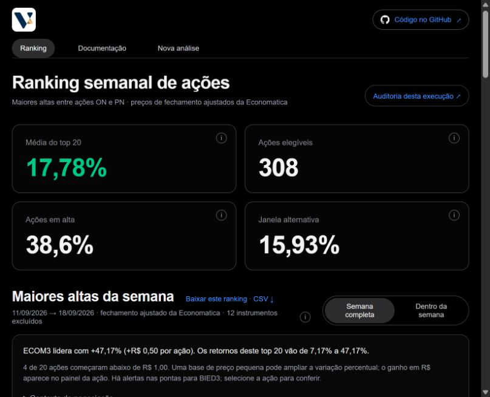
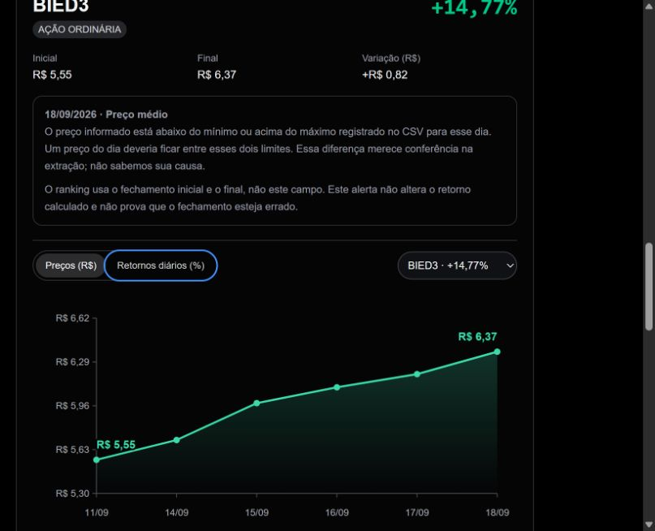

# Como usar o dashboard

O dashboard apresenta os resultados calculados pelo Python. Os controles mudam a visualização; não alteram os preços recebidos ou recalculam o ranking no navegador.

## Leia os indicadores

| Indicador | Interpretação |
| --- | --- |
| Média do top 20 | Média aritmética dos 20 retornos da janela selecionada |
| Ações elegíveis | ON/PN com duas pontas utilizáveis e confirmação oficial |
| Ações em alta | Proporção com retorno positivo entre as elegíveis |
| Janela alternativa | Média do top 20 usando primeiro e último fechamento dentro da semana |

Os ícones de informação exibem explicações curtas ao passar o mouse ou receber foco pelo teclado. No celular, toque para abrir ou fechar; tocar fora também fecha a explicação. Para aprofundar os critérios, consulte a [metodologia](metodologia.md).

Os percentuais dos cards usam duas casas decimais; a quantidade de ações permanece inteira. Na referência, 119 de 308 ações tiveram retorno positivo: **38,64%**. Essa proporção conta as ações que subiram, independentemente da intensidade de cada alta.

**Semana completa:** usa o fechamento antes de a semana começar e o último disponível nela. Na referência, compara o preço no fim de 11/09 com o preço no fim de 18/09; assim, inclui também a mudança do primeiro dia com dados, 14/09. **Dentro da semana:** começa no preço ao fim de 14/09 e termina ao fim de 18/09. A mudança até o fechamento de 14/09 fica de fora, pois esse fechamento já é o ponto de partida. As duas opções terminam na mesma data da semana anterior; a alternativa não acompanha os dados até o dia atual. Os textos de informação mostram as datas da execução consultada.

## Explore uma ação

Selecione uma linha do ranking ou escolha o ticker no controle junto ao gráfico. O painel mostra o ativo selecionado e o retorno da janela exibida. No celular, o ranking prioriza posição, ticker e retorno; selecionar a linha abre o gráfico, onde é possível conferir os preços e a espécie. Use “Voltar ao ranking” para continuar a exploração.

- **Preços (R$):** fechamentos observados em reais por ação, somente entre o início e o fim da janela selecionada.
- **Retornos diários (%):** variações entre datas consecutivas da extração dentro da janela selecionada. Na alternativa, o primeiro dia aparece como “—”: seu fechamento é o preço inicial, e o primeiro retorno aparece na próxima data da extração com comparação válida.
- **Hover ou foco nos pontos:** detalhes do valor e da data; para um retorno, aparecem as duas datas comparadas. No dispositivo móvel, toque na região da observação; o valor aparece abaixo do gráfico.
- **Valores nas extremidades:** preços inicial e final da série exibida no modo de preços.

Uma lacuna não é uma variação de zero. Veja [por que podem faltar dados](duvidas.md).

## Compare o contexto

A distribuição agrupa os retornos das ações elegíveis. A proporção de altas e baixas descreve essa amostra, não todo o mercado.

No dashboard, a matriz diária vem depois do ranking e do gráfico da ação. “Além do top 20” aparece por último, para ampliar a leitura para todas as ações elegíveis.

A matriz do top 20 apresenta movimentos diários com cores e valores. No celular, deslize dentro da matriz para consultar as datas e ações; ticker e cabeçalhos permanecem fixos. Tocar no ticker abre seu gráfico. Na alternativa, a célula do primeiro dia mostra “—” porque aquele fechamento é o preço inicial: não é zero nem dado ausente. Nas outras datas, “—” significa que faltam preços utilizáveis para aquela comparação. A explicação acima da matriz acompanha a opção selecionada; a descrição de cada célula informa a comparação ou o motivo da ausência. A fórmula semanal usa suas próprias duas pontas; não soma os percentuais da matriz.

## Baixe e confira

O link ao lado de “Maiores retornos da semana” baixa o ranking da janela exibida. A auditoria da execução reúne os demais arquivos permitidos, as datas e os alertas. Guarde o endereço web (URL) da sua análise e baixe os arquivos que quiser conservar nos sete dias de disponibilidade. O case continua na página inicial; um novo envio não o substitui.

## Envie outra extração

1. Abra [Nova análise](/nova-analise) e selecione um CSV de até 10 MB.
2. Confira a data de referência e a semana indicada. A referência define a semana-calendário anterior.
3. Envie e acompanhe a etapa do processamento.
4. Ao concluir, explore o resultado e abra sua auditoria. Se falhar, leia o motivo antes de tentar novamente.

O resultado de teste fica disponível por sete dias. O CSV bruto é removido após 24 horas e não é oferecido para download. Consulte [formato e tratamento](dados.md) antes de enviar outro esquema.

### Se a semana terminar antes de sexta-feira

O primeiro envio abrirá uma revisão no próprio formulário, sem criar análise nem guardar o CSV dessa tentativa. Confira as datas e a extração original. A ausência pode ser feriado ou arquivo incompleto; o site não decide a causa. Se você aceitar essas datas, marque a confirmação e execute novamente. A auditoria e o registro do envio mostrarão a decisão. Alterar arquivo ou referência exige nova revisão. Uma cobertura insuficiente impede continuar.

Se a análise falhar depois disso, a página apresenta o motivo e a orientação aplicável. A confirmação não substitui a classificação B3 nem corrige preços.

## Navegação no celular

Na documentação, “Assuntos” escolhe o artigo e “Nesta página” abre seu índice; as setas indicam abertura e fechamento. Os controles continuam acessíveis durante a leitura. Na auditoria, use o seletor de seção e consulte os arquivos agrupados em rankings, qualidade, classificação e reprodução. A tela cheia permanece disponível no desktop e é ocultada no mobile.

## Interprete os destaques e a variação em reais

O resumo acompanha a janela escolhida: informa o líder, a faixa de retornos do top, quantas ações começaram abaixo de R$ 1,00 e quais têm alertas nas duas pontas. São descrições dos dados, sem inferir causas das altas.

O painel da ação mostra os fechamentos inicial e final e a diferença **final − inicial**, em reais por ação ajustada, calculada em Python com precisão decimal. A diferença não é lucro de uma operação: não considera custos nem uma quantidade negociada. Valores pequenos podem aparecer com até seis casas na interface; os preços exatos permanecem nos CSVs auditados. A variação absoluta não muda a ordenação por retorno percentual.

A marca de informação no ticker indica um alerta da janela selecionada. Ao selecionar a ação, o painel mostra data, campo, motivo e se o campo entra na fórmula. Esses alertas consideram as duas pontas; não garantem ausência de problemas nos dias intermediários. A auditoria contém o contexto mais amplo.

“Contexto de negociação” explica a limitação da extração: volume bruto e quantidade ajustada podem usar bases diferentes. Sem confirmação de escala e comparabilidade, a interface não apresenta um indicador de liquidez ou inferências sobre facilidade de negociação. Nenhum filtro de liquidez foi aplicado.

## Exemplos visuais da referência

As capturas abaixo usam a referência de **22/09/2026**. Em outra análise, os tickers, as datas e os valores são os da sua execução.

**Como ler:** os cards descrevem a amostra; o resumo identifica o líder e a faixa de retornos do top. “Semana completa” e “Dentro da semana” escolhem as pontas usadas na comparação. O CSV ao lado do título acompanha essa escolha.

**Exemplo de alerta:** em BIED3, o preço médio recebido em 18/09 ficou fora do mínimo e do máximo informados para o dia. Isso merece conferência no CSV, mas não prova que o fechamento esteja errado. O ranking usa os fechamentos de R$ 5,55 e R$ 6,37: a diferença é R$ 0,82 por ação ajustada, e o retorno é 14,77%. O preço médio não entra nessa fórmula.

No celular, abra o menu pelo botão de três linhas. Selecione a ação no ranking para ir ao painel; use “Voltar ao ranking” para continuar. Os ícones de informação abrem com toque e fecham com outro toque ou ao tocar fora. A tela cheia é uma opção do desktop.
