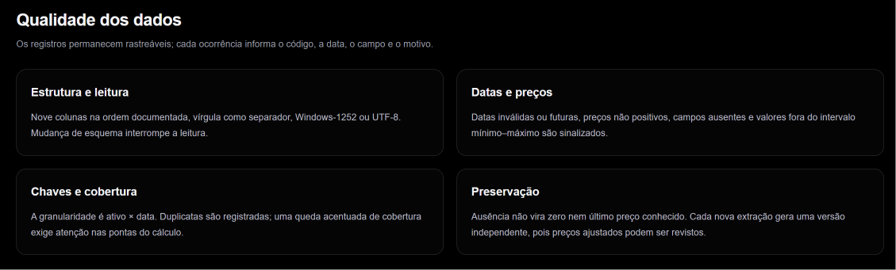

# Dados e tratamento

A extração é o arquivo CSV exportado da Economatica. Cada linha contém os dados de um instrumento financeiro em uma data. O tratamento, executado em Python, interpreta esse arquivo, organiza os campos e registra problemas antes da seleção das ações.

## Formato aceito

Use o mesmo formato do case: nove colunas na ordem abaixo, vírgula como separador, ponto decimal nos números e datas no formato **AAAA-MM-DD**, como `2026-09-18`. O arquivo pode estar em UTF-8 ou Windows-1252, duas formas de codificar os caracteres do texto.

```text
Ativo
Data
Fechamento|ajust p/ prov|Em moeda orig
Q Títs|ajust p/ prov
Abertura|ajust p/ prov|Em moeda orig
Máximo|ajust p/ prov|Em moeda orig
Mínimo|ajust p/ prov|Em moeda orig
Médio|ajust p/ prov|Em moeda orig
Volume$|Em moeda orig
```

Uma coluna renomeada, ordem diferente ou separador incompatível impede a leitura. Exporte novamente no formato documentado; trocar apenas a extensão para `.csv` não corrige a estrutura.

### Exemplo de linhas do arquivo

O exemplo abaixo é fictício e serve para mostrar o formato. Ele não contém as 20 ações necessárias para produzir um ranking nem constitui confirmação oficial de um instrumento.

```csv
Ativo,Data,Fechamento|ajust p/ prov|Em moeda orig,Q Títs|ajust p/ prov,Abertura|ajust p/ prov|Em moeda orig,Máximo|ajust p/ prov|Em moeda orig,Mínimo|ajust p/ prov|Em moeda orig,Médio|ajust p/ prov|Em moeda orig,Volume$|Em moeda orig
ABCD3<XBSP>,2026-09-11,10,1000,10,10,10,10,10000
ABCD3<XBSP>,2026-09-14,-,1000,11,11,11,11,11000
ABCD3<XBSP>,2026-09-18,12,1000,12,12,12,12,12000
```

Há três linhas para o mesmo instrumento, uma por data. O fechamento de 14/09 está ausente: `-` não significa zero. Os fechamentos de 11/09 e 18/09 permitem comparar o preço inicial com o final; a ausência no meio impede as comparações diárias que dependem de 14/09. A inclusão no ranking ainda depende das demais verificações e da confirmação ON/PN.

## Confira antes de enviar

- Abra o CSV como texto para conferir o cabeçalho, a ordem das colunas e os separadores.
- Confira se as datas e os números seguem os formatos documentados. No arquivo, `1.56` é um preço válido; `1,56` interfere no separador de colunas.
- Inclua preços anteriores à semana e pelo menos duas datas com preços dentro dela. Veja [como a referência define a semana](metodologia.md#qual-semana-é-analisada).
- Confira valores e eventuais linhas repetidas na fonte original. Não preencha ausências com zero ou com o preço de outro dia.
- O envio público aceita até 10 MB. Preserve uma cópia do CSV original para reproduzir a análise posteriormente.

## O que a ferramenta faz com cada linha

O tratamento registra a linha de origem, interpreta o código e a data e converte os números preservando a precisão recebida. Também mantém o conteúdo original para relacionar uma ocorrência ao arquivo enviado.

**Padronizar não significa corrigir um preço.** A ferramenta não aplica novos ajustes aos fechamentos da Economatica, não substitui preços pelos da B3 e não preenche valores ausentes com o último preço conhecido.

Uma nova extração é uma análise independente. Se o fornecedor revisar preços ajustados, a nova entrada pode produzir outro resultado; as linhas não são acrescentadas automaticamente à análise anterior.

## Volume financeiro e cobertura diária

`Volume$|Em moeda orig` é o volume financeiro informado pela Economatica para o instrumento e a data. A ferramenta mostra o campo recebido e sua média por dia dentro da semana. Não o reconstrói a partir da quantidade ajustada e do preço, nem o substitui por volume obtido na B3; essas bases podem diferir.

Zero explícito é um dado válido. Valor ausente, negativo, não numérico ou duplicado fica sem volume e não entra na média. A indicação “4 de 5 dias” significa que quatro das cinco datas observadas da semana têm volume utilizável para aquela ação; não significa quatro semanas nem quatro negociações.

Um fechamento ausente pode deixar o gráfico de retornos vazio mesmo quando o volume do dia está disponível. Um volume ausente também não impede um retorno com dois fechamentos válidos. Consulte [as regras de volume](metodologia.md#como-o-volume-é-apresentado) e guarde `volume_context.json` para conferir os valores da execução.

## Controles de qualidade

Um registro corresponde a **instrumento × data**, considerando também a bolsa indicada no código. Duas linhas com a mesma identificação são duplicatas, mesmo que tenham números iguais. Elas são registradas; não há escolha silenciosa de uma delas.

| Ocorrência | Efeito atual | Onde conferir |
| --- | --- | --- |
| Cabeçalho ou estrutura incompatível | Impede a leitura do arquivo | Mensagem do envio ou do comando |
| Fechamento ausente ou não positivo em uma data usada | O código pode ficar sem comparação válida e ser excluído | Exclusões das pontas |
| Duplicata de preço numa data usada | Gera conflito na classificação e pode impedir o ranking | Classificação nas pontas e ocorrências por linha |
| Erro no fechamento de uma ação elegível numa data usada | Interrompe o cálculo | Motivo da falha e registros de qualidade |
| Preço médio fora do mínimo–máximo informado | Registra aviso; o preço médio não entra no retorno | Painel da ação e contexto de qualidade |
| Fechamento fora do mínimo–máximo informado | Registra aviso; atualmente esse aviso sozinho não bloqueia o cálculo | Painel da ação e ocorrências por linha |
| Número, data ou linha inválida | Registra ocorrência quando o conteúdo pode ser tratado; pode impedir o processamento | Mensagem apresentada e ocorrências disponíveis |

O efeito depende do campo, da data e da etapa que utiliza o registro. Um problema num dia intermediário pode deixar uma lacuna no gráfico sem impedir o retorno semanal, que compara apenas os fechamentos inicial e final.

### O que significa cobertura

Cobertura descreve a quantidade de dados disponíveis em uma data. Os arquivos de qualidade distinguem linhas, códigos e fechamentos positivos. **O controle usado para selecionar as datas compara contagens de linhas com fechamento positivo**, antes de confirmar quais instrumentos são ações ON/PN. Essa contagem não é a quantidade de ações elegíveis do resumo.

Uma queda acentuada nessas contagens pode indicar exportação parcial. Veja [os limites e seus efeitos](metodologia.md#verificações-antes-de-calcular-o-ranking).



*Este painel resume as verificações; não comprova que uma base esteja livre de problemas. As ocorrências registram linha, código, data, campo e motivo. Um alerta em outro campo não altera automaticamente o fechamento usado no retorno.* [Ampliar imagem](assets/qualidade-dados-20261007.png).

### Limites atuais da validação

O aviso de fechamento fora do mínimo–máximo merece conferência porque o fechamento entra na fórmula. Um resultado concluído não garante ausência dessa inconsistência. O sistema preserva os valores e não identifica automaticamente sua causa.

O tratamento de linhas malformadas ainda pode terminar com ocorrência registrada ou falha, dependendo da estrutura recuperável. Também não se deve presumir que a bolsa e a moeda de qualquer arquivo externo foram validadas integralmente. Use o formato e o universo brasileiro previstos para o case; entradas de outros mercados exigem revisão da identificação dos instrumentos.

Volume financeiro bruto e quantidade ajustada podem utilizar bases diferentes. Uma divergência entre eles não autoriza corrigir preços ou concluir que uma ação possui determinada liquidez.

## Arquivos do tratamento

Na auditoria pública, consulte “Qualidade e exclusões” para abrir os registros permitidos. O CSV original e a base normalizada completa não são oferecidos para download. Uma ocorrência identifica a linha original, o código, a data, o campo e o motivo; veja [como investigar um alerta](auditoria.md#investigar-um-alerta).

Quem executa pelo Python recebe também a cópia original, `normalized.csv`, `quality_issues.csv`, `quality_by_date.csv`, `quality_summary.json` e `manifest.json` na pasta da execução. O manifesto é um registro da entrada, dos parâmetros e das assinaturas dos arquivos produzidos.

## Referência dos campos internos

Estes nomes aparecem nos arquivos técnicos, não são colunas adicionais exigidas no CSV enviado.

| Campo | Significado |
| --- | --- |
| `record_id`, `source_line` | Identificação do registro e linha física no CSV original |
| `ativo_original`, `data_original` | Código e data recebidos, antes da padronização |
| `ticker`, `exchange` | Código da ação e bolsa indicada na entrada |
| `trade_date` | Data interpretada como AAAA-MM-DD |
| `close`, `open`, `high`, `low`, `average` | Fechamento, abertura, máximo, mínimo e preço médio |
| `adjusted_quantity`, `raw_volume` | Quantidade ajustada e volume financeiro recebido |
| `instrument_type`, `classification_source` | Tipo inicialmente atribuído e origem dessa identificação |
| `raw_fields_json`, `parse_status` | Conteúdo recebido e situação da interpretação da linha |

A classificação inicial pode ser provisória. Veja a [confirmação dos instrumentos](classificacao.md) e o [dicionário técnico completo](referencia-tecnica.md#saídas-de-cada-execução).

Para executar apenas o tratamento:

```powershell
python etl.py --input "CAMINHO\economatica.csv" --reference-date 2026-09-22 --output-dir "runs\tratamento"
```

Substitua o caminho e a referência pelos da sua entrada. Esse comando prepara os dados; o ranking completo é produzido pelo comando descrito em [Auditoria e reprodução](auditoria.md#reproduza-pelo-python).
