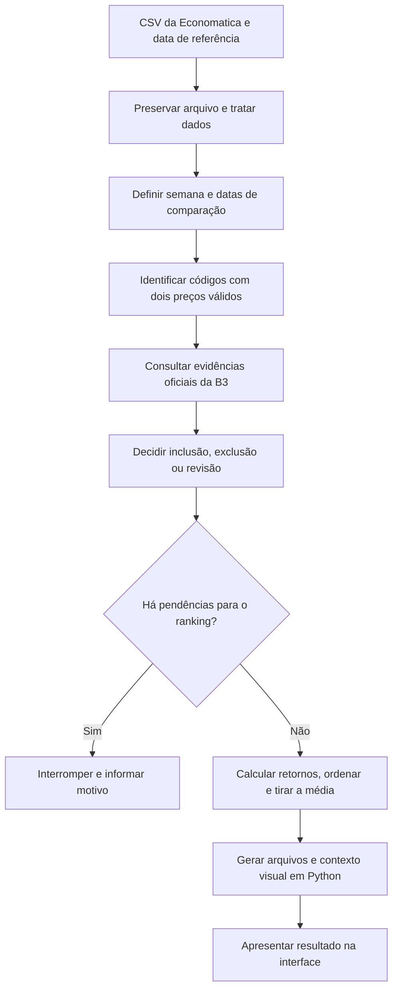
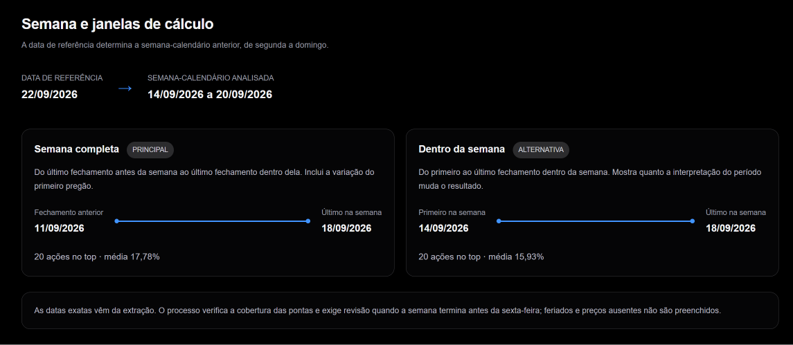
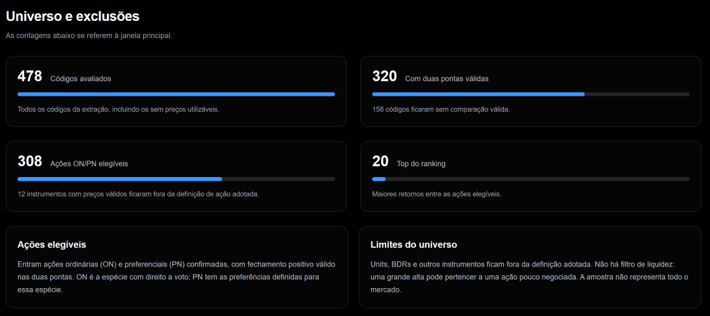
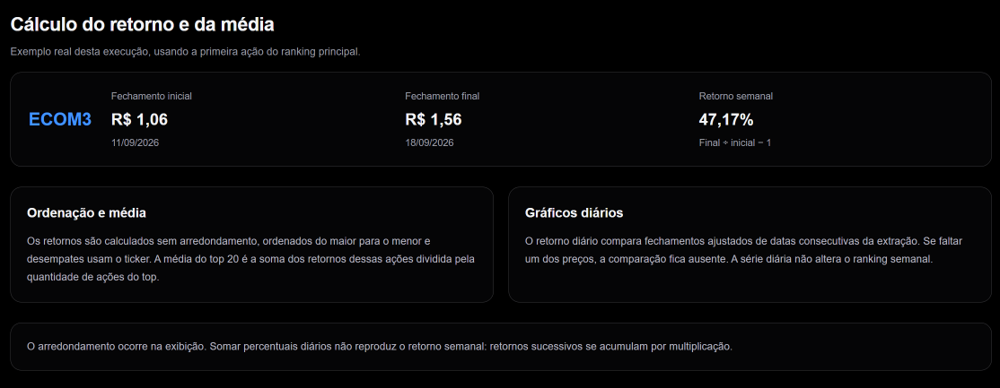

# Metodologia do ranking semanal

O ranking apresenta **os 20 maiores retornos de preço** entre as ações ordinárias (ON) e preferenciais (PN) elegíveis no arquivo recebido. Os preços vêm da plataforma de dados financeiros Economatica. Os registros oficiais da B3 são utilizados para confirmar se cada instrumento é uma ação ON ou PN.

Este artigo explica como os scripts Python selecionam as datas, verificam os dados e calculam o ranking. Os exemplos utilizam o case, com **data de referência de 22/09/2026**. Uma nova análise utiliza seu próprio arquivo e sua própria data de referência, produzindo datas, ações, contagens e resultados próprios.

## Nesta página

- [Da extração à apresentação](#da-extração-à-apresentação)
- [Qual semana é analisada](#qual-semana-é-analisada)
- [Quais ações entram](#quais-ações-entram)
- [Como o retorno é calculado](#como-o-retorno-é-calculado)
- [Como se formam o top 20 e a média](#como-se-formam-o-top-20-e-a-média)
- [Para que serve a janela alternativa](#para-que-serve-a-janela-alternativa)
- [Como interpretar os gráficos diários](#como-interpretar-os-gráficos-diários)
- [Como o volume é apresentado](#como-o-volume-é-apresentado)
- [Como o contexto é preparado](#como-o-contexto-é-preparado)
- [Quando o resultado é interrompido](#quando-o-resultado-é-interrompido)
- [Como conferir e reproduzir](#como-conferir-e-reproduzir)
- [Limites de interpretação](#limites-de-interpretação)

## Da extração à apresentação



Em palavras: o arquivo original é preservado; os dados são interpretados e validados; a semana é definida; as ações com dois preços utilizáveis são confirmadas; os retornos são calculados e ordenados; a interface apresenta os arquivos produzidos. Uma pendência relevante impede a publicação de um ranking aparentemente completo.

O tratamento inicial mantém todas as linhas rastreáveis. A seleção de elegíveis acontece depois. Preço ausente permanece ausente: não vira zero nem recebe o último preço conhecido.

Os retornos do ranking e os dados dos gráficos são produzidos em Python. O navegador apresenta os valores e permite explorar o resultado.

## Qual semana é analisada

A **data de referência** serve para escolher a semana anterior à semana em que essa data está, considerando o período de segunda-feira a domingo. Ela não é uma data de preço utilizada diretamente no cálculo.

No case, a referência de **22/09/2026** está na semana de 21 a 27/09. Portanto, a semana analisada é **14 a 20/09/2026**.

| Marco | Data | Papel |
| --- | --- | --- |
| Referência | 22/09/2026 | Define a semana anterior |
| Semana anterior | 14 a 20/09/2026 | Período que queremos analisar |
| Último fechamento antes da semana | 11/09/2026 | Preço inicial da opção “Semana completa” |
| Primeiro fechamento na semana | 14/09/2026 | Preço inicial da alternativa “Dentro da semana” |
| Último fechamento na semana | 18/09/2026 | Preço final das duas opções |



*A captura mostra as duas opções do case lado a lado. Ambas terminam em 18/09; a principal começa em 11/09 e a alternativa em 14/09. As médias de 17,78% e 15,93% pertencem a essa execução.* [Ampliar imagem](assets/semana-janelas-20261007.png).

### Semana completa: como o cálculo inclui a variação da segunda-feira

Para medir a semana completa, comparamos:

- O último fechamento disponível **antes de a semana começar**.
- O último fechamento disponível **dentro da semana**.

No case, esses preços são os fechamentos de **sexta-feira, 11/09**, e de **sexta-feira, 18/09**.

A comparação começa no fechamento anterior à semana porque a mudança de preço da segunda-feira acontece entre esse fechamento e o fechamento da própria segunda-feira. Se começássemos pelo preço ao fim da segunda-feira, essa mudança ficaria de fora. Se o primeiro dia com dados for outro dia da semana, o mesmo raciocínio se aplica a ele.

**Exemplo fictício:** uma ação fecha a sexta-feira anterior a R$ 10,00, a segunda-feira a R$ 11,00 e a sexta-feira seguinte a R$ 12,00.

- **Semana completa:** compara R$ 10,00 com R$ 12,00. Retorno de **20,00%**, incluindo a mudança até o fechamento da segunda-feira.
- **Dentro da semana:** compara R$ 11,00 com R$ 12,00. Retorno de **9,09%**, deixando de fora a mudança até o fechamento da segunda-feira.

As datas são escolhidas a partir da **extração: o arquivo CSV exportado da Economatica**, que contém os instrumentos, as datas e os preços recebidos. O sistema procura datas com fechamentos positivos, isto é, maiores que zero.

Cada opção utiliza as mesmas datas inicial e final para todas as ações. Se uma ação não tiver preço utilizável em uma dessas datas, ela não participa daquele ranking. O sistema não escolhe outra data apenas para incluí-la.

### Verificações antes de calcular o ranking

Os scripts Python verificam se o arquivo contém preços antes da semana e dentro dela. Também aplicam os controles abaixo.

#### 1. Pedir revisão quando os dados terminam antes da sexta-feira

Se o último dia com fechamento positivo dentro da semana for uma quinta-feira ou um dia anterior, o sistema pede revisão antes de continuar.

**Exemplo:** a semana deveria ser analisada até sexta-feira, mas o arquivo só possui preços até quinta-feira.

Isso pode acontecer porque não houve negociação na sexta-feira ou porque o arquivo está incompleto. Continuar automaticamente poderia apresentar como resultado da semana uma comparação que terminou antes do esperado.

A revisão permite aceitar explicitamente a última data disponível. **Essa aceitação não cria preços para os dias ausentes** e não dispensa as outras verificações.

#### 2. Impedir o uso de um preço inicial muito antigo

O cálculo é interrompido se o último fechamento disponível antes da semana estiver **mais de dez dias corridos antes da segunda-feira**.

O objetivo é evitar que a comparação inclua um período anterior muito maior do que a semana que queremos analisar.

**Exemplo:** para uma semana iniciada em 14/09, usar um preço de 01/09 como ponto inicial incluiria também mudanças ocorridas muito antes daquela semana.

Dez dias é um limite definido neste projeto, não uma regra da B3. É uma proteção adotada pela ferramenta para impedir uma comparação com um preço inicial muito distante.

#### 3. Verificar se as datas escolhidas possuem dados suficientes

O sistema conta quantas linhas têm fechamento positivo em cada uma das três datas: anterior à semana, primeira dentro dela e última dentro dela. Essa contagem de linhas ainda não é a quantidade de ações elegíveis; a confirmação de ON/PN acontece depois.

Depois, compara essas contagens com um valor de referência calculado a partir de até dez datas recentes do arquivo, com preços positivos, até a última data da semana. Essas datas podem incluir dias da própria semana analisada.

Se alguma das três datas tiver **menos da metade desse valor**, o cálculo é interrompido.

**Exemplo:** se o valor de referência for 300 linhas, uma data com apenas 100 não passa na verificação. Ela pode representar uma parte incompleta do arquivo, reduzindo as ações disponíveis e afetando o ranking. Uma data com 150 atende a esse limite, pois possui exatamente a metade; as demais verificações continuam necessárias.

Esse controle identifica uma redução acentuada na quantidade de dados. **Não comprova que o arquivo esteja completo.** O limite de metade também é uma decisão do projeto.

**Detalhe do cálculo:** são utilizadas as até dez datas mais recentes com fechamentos positivos, até a última data da semana. As contagens são ordenadas da menor para a maior, e o valor central é escolhido como referência. Se houver duas posições centrais, utiliza-se a maior delas, chamada mediana superior.

#### 4. Exigir duas datas diferentes dentro da semana

A alternativa compara o primeiro fechamento dentro da semana com o último. Por isso, precisa de **pelo menos duas datas diferentes com preços**.

Com apenas uma data, teríamos um único ponto de preço: não seria possível medir a mudança entre o início e o fim.

Atualmente, essa situação interrompe a análise inteira, pois a ferramenta produz as duas comparações na mesma execução.

### Como revisar as datas em uma nova análise

Na página [Nova análise](/nova-analise), você envia o CSV e escolhe a data de referência.

Quando os dados da semana terminam antes da sexta-feira, o formulário apresenta as três datas escolhidas e a quantidade de linhas com fechamento positivo em cada uma. Confira essas informações no arquivo original antes de aceitar a comparação.

A confirmação vale apenas para **aquele arquivo e aquela data de referência**. Se você trocar qualquer um deles, precisará revisar novamente. A aceitação fica registrada na auditoria e no arquivo `analysis_request.json`.

Após o envio, um processo no servidor executa os scripts Python e repete as verificações antes de gerar o resultado. Esse processo é chamado de *worker* no código.

Para quem executa pelo terminal, a aceitação é informada pelo parâmetro `--allow-nonfriday-end`.

### Por que o sistema não identifica automaticamente um feriado?

Um arquivo sem preços na sexta-feira não informa, por si só, a causa dessa ausência.

Pode ter sido um feriado, uma falha na exportação ou outro problema nos dados. Por isso, a ferramenta pede conferência em vez de afirmar que foi feriado.

## Quais ações entram

Uma ação participa de uma opção do ranking quando:

1. Possui fechamento maior que zero e utilizável nas datas inicial e final dessa opção, chamadas pontas do cálculo.
2. Seu código, o ticker, segue a indicação ON/PN adotada pelo projeto.
3. Os registros oficiais da B3 confirmam o mesmo tipo de ação e uma identificação compatível nas duas datas.
4. Não possui pendência de classificação nem erro bloqueador no fechamento utilizado.

Uma ação ordinária é identificada como ON; uma preferencial, como PN. A confirmação oficial utiliza a espécie e identificadores do instrumento, não os preços da B3. Veja [como essa decisão é feita](classificacao.md).

O universo elegível é o conjunto que atende a esses requisitos. BDRs, units e outros produtos ficam fora da definição de ação individual ON/PN adotada. Um código sem os dois preços utilizáveis recebe um motivo de exclusão; uma candidata com confirmação pendente ou identificação conflitante pode impedir a análise inteira.

Não há filtro de liquidez. A quantidade elegível depende do arquivo recebido e das datas, e não representa necessariamente todas as ações da B3. Os avisos de qualidade possuem efeitos distintos: atualmente, fechamento fora do mínimo–máximo gera aviso, mas esse aviso sozinho não bloqueia o ranking. Confira [os limites da validação](dados.md#limites-atuais-da-validação).

### Exemplo da execução de referência

| Etapa | Quantidade |
| --- | ---: |
| Códigos na extração | 478 |
| Sem duas pontas válidas | 158 |
| Com duas pontas válidas | 320 |
| Instrumentos fora do universo ON/PN | 12 |
| Ações elegíveis | 308 |
| Ações no ranking apresentado | 20 |



*De 478 códigos, 158 ficaram sem comparação válida. Dos 320 restantes, 12 não pertenciam ao universo ON/PN; sobraram 308 elegíveis, das quais são selecionadas as 20 de maior retorno. Essas contagens podem mudar em outra análise.* [Ampliar imagem](assets/universo-exclusoes-20261007.png).

Os 158 códigos sem duas pontas não são perdas silenciosas: os motivos ficam registrados nas exclusões. Os 12 instrumentos com preços válidos, mas fora do universo, têm uma decisão distinta.

## Como o retorno é calculado

Usamos o **fechamento ajustado da Economatica** nas duas datas:

```text
Retorno = fechamento final ÷ fechamento inicial − 1
Retorno em porcentagem = retorno × 100
```

A B3 não substitui os preços da Economatica. Isso evita combinar séries de fontes e bases de ajuste diferentes.

### Exemplo real: ECOM3

| Informação | Valor |
| --- | ---: |
| Fechamento de 11/09/2026 | R$ 1,06 |
| Fechamento de 18/09/2026 | R$ 1,56 |
| Diferença de preço | R$ 0,50 |
| Retorno apresentado | 47,17% |

```text
1,56 ÷ 1,06 − 1 = 0,471698…
0,471698… × 100 = 47,169811…%
Exibição com duas casas = 47,17%
```



*47,17% é o retorno individual de ECOM3, não a média do top 20. A média soma os retornos das 20 ações e divide por 20. O arredondamento ocorre na exibição, e somar retornos diários não reproduz o retorno semanal.* [Ampliar imagem](assets/calculo-retorno-media-20261007.png).

Dividimos pela base inicial porque queremos saber quanto o preço variou em relação ao valor do início. A diferença de R$ 0,50, sozinha, não permite comparar ações com preços diferentes.

O pipeline usa números decimais a partir dos valores recebidos. Não arredonda previamente os preços ou retornos para ordenar; divisões utilizam a precisão do cálculo decimal. A apresentação em duas casas não muda a posição calculada.

## Como se formam o top 20 e a média

Após calcular o retorno de cada ação elegível:

1. Ordenamos pelo retorno calculado, do maior para o menor.
2. Em empate desse valor, usamos o ticker em ordem crescente.
3. Selecionamos as primeiras 20 ações.
4. Somamos seus retornos e dividimos por 20.

```text
Média do top 20 = (retorno 1 + retorno 2 + … + retorno 20) ÷ 20
```

Cada linha do ranking mostra o retorno individual de uma ação no período; a média dos 20 retornos aparece no card “Média do top 20”. Cada ação tem o mesmo peso nessa média. Na referência, o valor calculado é aproximadamente **17,777107%**, apresentado como **17,78%**.

Essa é a média dos 20 maiores retornos selecionados após observar o período. Não é a média das 308 elegíveis, o retorno de um índice ou o resultado de uma estratégia executada antes da semana.

Se houver menos de 20 ações elegíveis, o programa interrompe a execução. Ele não entrega um top menor com o mesmo rótulo.

## Para que serve a janela alternativa

A alternativa compara o primeiro e o último fechamento **dentro da semana**: no exemplo, **14/09 a 18/09**.

As duas opções analisam a mesma semana-calendário anterior e terminam na mesma data. A alternativa não se estende até o dia atual: apenas começa no fechamento do primeiro dia disponível dentro da semana, deixando de fora a mudança até esse fechamento.

O [exemplo de R$ 10,00, R$ 11,00 e R$ 12,00](#semana-completa-como-o-cálculo-inclui-a-variação-da-segunda-feira) mostra por que retirar a mudança até o primeiro fechamento altera o retorno.

A alternativa também pode mudar quais ações participam: uma ação pode ter preços em 11/09 e 18/09, mas não em 14/09. Nesse caso, pode atender à comparação principal e ficar de fora da alternativa. As ações são verificadas novamente nas duas datas da alternativa, e seu top 20 é ordenado com esses retornos. Não é apenas uma alteração do gráfico das mesmas 20 ações.

| Resultado da referência | Principal | Alternativa |
| --- | ---: | ---: |
| Pontas | 11 a 18/09/2026 | 14 a 18/09/2026 |
| Ações elegíveis | 308 | 302 |
| Média do top 20 | 17,78% | 15,93% |

Há 16 ações em comum nos dois top 20. A alternativa acompanha a análise; não substitui a regra principal.

## Como interpretar os gráficos diários

Os gráficos e a tabela diária acompanham a janela selecionada. No case:

| Visualização | Semana completa | Dentro da semana — alternativa |
| --- | --- | --- |
| Gráfico de preços | Fechamentos de 11/09 a 18/09 | Fechamentos de 14/09 a 18/09 |
| Retorno diário de 14/09 | Compara 11/09 → 14/09 | —: 14/09 é o preço inicial |
| Primeiro retorno da alternativa | Não se aplica | 15/09: compara 14/09 → 15/09 |

Na alternativa, o primeiro dia não tem retorno dentro da janela: é o fechamento do qual partimos. O **—** desse dia não significa zero nem falta de preço. Os outros dias com **—** indicam que não há dois preços utilizáveis para comparar. As datas são as da execução; um feriado ou ausência de dados pode fazer o primeiro fechamento cair em outro dia da semana.

O gráfico de preços mostra os fechamentos válidos observados. A variação diária compara duas datas consecutivas da extração:

```text
Variação diária = (fechamento atual ÷ fechamento anterior − 1) × 100
```

Ao passar o mouse, tocar ou focar uma observação do gráfico, a explicação do retorno mostra a data anterior e a data atual comparadas. Na tabela diária, a descrição da célula também identifica essa comparação.

Se faltar um dos preços, a variação não é calculada. O sistema não pula a lacuna para apresentar uma variação de vários dias como diária. Datas consecutivas da extração podem estar separadas por vários dias de calendário; não há calendário oficial de pregões nessa construção visual.

Uma ação pode ter retorno semanal válido e células diárias vazias: basta possuir as duas pontas semanais e faltar um preço intermediário. Lacunas e preços conflitantes permanecem visíveis.

Somar percentuais diários não reproduz, em geral, o retorno semanal. Quando todas as comparações necessárias estão disponíveis, a conexão é multiplicativa: `(1 + r1) × (1 + r2) × … − 1`, com retornos em fração.

## Como o volume é apresentado

O volume financeiro vem da coluna `Volume$|Em moeda orig` do CSV da Economatica. A ferramenta conserva esses valores; não substitui o volume por dados da B3 nem calcula volume multiplicando fechamento por quantidade ajustada.

Para cada ação, a média diária é a soma dos volumes válidos nos dias observados da semana dividida pela quantidade desses dias. Exemplo ilustrativo: R$ 100,00, R$ 0,00 e um volume ausente produzem média de R$ 50,00, com dois de três dias válidos. O zero foi informado; a ausência não foi transformada em zero.

Um volume é utilizável quando é numérico, finito, não negativo e pertence a um único registro válido de ação e data. Valores ausentes, inválidos e duplicados ficam sem volume. Um volume pode estar disponível mesmo quando falta o fechamento necessário para o retorno diário; são campos diferentes.

Os dias considerados são as datas da extração com algum fechamento positivo, entre o início da semana e o fechamento final escolhido. Não entram dias sem observações nem o volume do fechamento anterior à semana. As janelas principal e alternativa usam esses mesmos dias para o volume; as ações do top podem ser diferentes em cada janela.

A coluna do ranking informa a média e a cobertura, como “4 de 5 dias”. Médias com coberturas diferentes exigem atenção na comparação. A tabela diária usa uma escala azul comum para comparar valores informados. O volume não entra na fórmula do retorno, no desempate, na média dos retornos ou na elegibilidade; não há filtro de liquidez.

## Como o contexto é preparado

Depois dos cálculos, uma etapa opcional reúne fontes sobre as empresas presentes nos tops das duas janelas. A identidade empresarial é conferida antes de associar documentos a um ticker; duas espécies da mesma empresa podem compartilhar as informações empresariais.

A coleta procura acontecimentos da semana e antecedentes de até 90 dias antes dela. Datas e trechos das fontes são conferidos automaticamente; propostas de acontecimentos válidas passam por uma segunda leitura por IA. Quando não há acontecimentos válidos, o sistema pode apresentar um resumo financeiro produzido em Python, sem essa segunda chamada ao modelo. Os novos textos não recebem revisão humana individual.

**Acontecimento da semana** descreve algo publicado naquele período. **Antecedente** descreve informação anterior, como o resultado de um trimestre. **Documento institucional** descreve regras ou atividades; sua publicação não comprova mudança empresarial. Informações posteriores ao fechamento, quando apresentadas, recebem indicação própria. Nenhuma dessas categorias comprova a causa do retorno.

As referências de mercado usam históricos de índices e dólar PTAX de fontes identificadas, com variações calculadas em Python nas datas de cada janela. PTAX é uma taxa de referência, não fechamento de mercado. Notícias de juros, economia e política dependem das evidências confirmadas; um tema pode ficar sem texto mesmo quando os indicadores estão disponíveis.

A geração conserva fontes, respostas e identificação da execução. Uma coleta futura pode encontrar documentos diferentes e produzir outra redação. A reprodução com os arquivos internos salvos é explicada em [Auditoria e reprodução](auditoria.md#conferir-recalcular-e-reproduzir-o-contexto). Uma falha dessa etapa preserva o ranking e o volume calculados.

## Quando o resultado é interrompido

| Situação | Comportamento |
| --- | --- |
| Estrutura do arquivo incompatível | Erro descritivo; não adivinha o esquema |
| Ausência de uma ponta para um código | Exclusão registrada desse código |
| Semana sem dados suficientes ou cobertura de ponta insuficiente | Interrompe a seleção da janela |
| ON/PN candidata sem confirmação oficial nas duas datas | Pendência de classificação; impede o ranking |
| Duplicata de preço na classificação ou divergência de espécie ou identificação entre fontes/datas | Registra revisão e impede o ranking |
| Ocorrência classificada como erro no fechamento de uma ação elegível numa data utilizada | Interrompe o cálculo |
| Fechamento fora do intervalo mínimo–máximo informado | Registra aviso; esse aviso sozinho não bloqueia o cálculo |
| Menos de 20 ações elegíveis | Interrompe o ranking |
| Fonte B3 indisponível | Só continua se as fontes disponíveis forem suficientes; caso contrário informa a falha |

Exclusão retira um código da comparação; revisão pendente ou erro bloqueador impede concluir a análise. Uma confirmação das datas no formulário não libera esses bloqueios.

Nem toda ocorrência é bloqueadora. Um preço médio fora do intervalo mínimo–máximo é registrado; ele não é usado na fórmula e não prova que o fechamento esteja errado. Nenhuma ocorrência autoriza corrigir silenciosamente os preços.

## Como conferir e reproduzir

No resultado publicado, os downloads permitidos incluem:

| Arquivo | Como usar |
| --- | --- |
| `top20.csv` | Conferir posições, pontas, preços e retornos do principal |
| `all_returns.csv` | Conferir os retornos de todas as ações elegíveis |
| `top20_alternativo.csv` | Conferir o top da outra janela |
| `all_returns_alternativo.csv` | Conferir o universo de retornos da alternativa |
| `candidate_exclusions.csv` | Conferir códigos sem duas pontas válidas e motivos |
| `quality_context.json` | Ler as ocorrências relacionadas às datas usadas |
| `volume_context.json` | Conferir volumes diários, ausências, datas e assinaturas da execução |
| `ranking_report.json` | Conferir datas, contagens, premissas, média e procedência |
| `README.md` | Ler o resumo da execução e as instruções de reprodução |

Na pasta completa gerada pelo comando Python, `classification/principal/ranking_universe.csv` registra as decisões de inclusão/exclusão de instrumentos com duas pontas. Na auditoria pública, ele está disponível como `ranking_universe.csv`; a alternativa usa `ranking_universe_alternativo.csv`. Os arquivos completos do tratamento também ficam nessa pasta, separados das saídas de ranking.

O relatório registra uma **assinatura do conteúdo do arquivo**, chamada hash SHA-256: ela permite verificar se dois arquivos têm o mesmo conteúdo. Essa assinatura identifica a entrada, mas não comprova que os dados estejam corretos. A procedência registra também a versão e a assinatura do código utilizado.

Os downloads públicos permitem conferir o resultado, mas não incluem o CSV original nem os arquivos originais B3. Para repetir o processamento, conserve sua própria entrada e os demais insumos. Consulte [o que guardar e como preparar o ambiente](auditoria.md#o-que-guardar-para-reproduzir).

Com Python 3.11+, ambiente preparado e CSV original disponível, rode na raiz do repositório:

```powershell
python weekly_ranking.py --input "CAMINHO\economatica.csv" --reference-date 2026-09-22 --output-dir "runs\semana-2026-09-22"
```

A data do comando é a do exemplo; substitua pela referência da nova análise. Fontes oficiais podem ser obtidas durante a execução. Com todas as fontes necessárias já disponíveis no cache, `--offline` permite repetir o processamento sem acesso à rede.

Para conferir a implementação:

- [weekly_ranking.py](../weekly_ranking.py): seleção da semana, controles, ordenação, média e relatório.
- [ranking_universe.py](../ranking_universe.py): regras de inclusão, exclusão e revisão.
- [resolve_period.py](../resolve_period.py): obtenção e reaproveitamento de fontes oficiais.
- [etl.py](../etl.py): leitura, normalização e controles dos dados recebidos.
- [webapp/presentation.py](../webapp/presentation.py): dados apresentados e séries diárias.
- [Relatório da referência](../resultados/2026-09-22/ranking_report.json): números usados neste artigo.

## Limites de interpretação

- Os gráficos apresentam dados históricos da extração, não cotações em tempo real.
- “Ações em alta” descreve o universo elegível da análise, não todo o mercado.
- A variação é calculada sobre preços ajustados fornecidos pela Economatica. O projeto não valida integralmente todos os eventos que originaram esses ajustes. A camada de contexto reúne fatos e antecedentes; não estabelece a causa dos movimentos.
- Não há filtro de liquidez, ponderação por tamanho, custos de transação ou simulação de execução de ordens.
- Uma nova extração é uma nova versão: preços ajustados podem ser revistos. Não anexamos cegamente os novos dados à execução anterior.
- A identificação completa de todo instrumento recebido é diferente da decisão de elegibilidade ON/PN. O ranking não promete catalogar todas as espécies financeiras.

## Revisão deste artigo

Revisado em **08/10/2026** para incluir volume, cobertura e contexto, preservando as explicações de datas, elegibilidade, retorno individual, média e bloqueios. Os exemplos numéricos pertencem à referência de 22/09/2026, exceto os identificados como ilustrativos. A identificação da revisão dos guias aparece nesta página; a auditoria informa qual cópia foi associada a cada execução, sem alterar o registro histórico do cálculo.

Os artigos de [guia de uso](como-usar.md), [dados](dados.md), [classificação](classificacao.md) e [arquitetura](sistema.md) complementam esta explicação. Sempre que uma regra mudar, este artigo deve ser revisado junto com o código.
