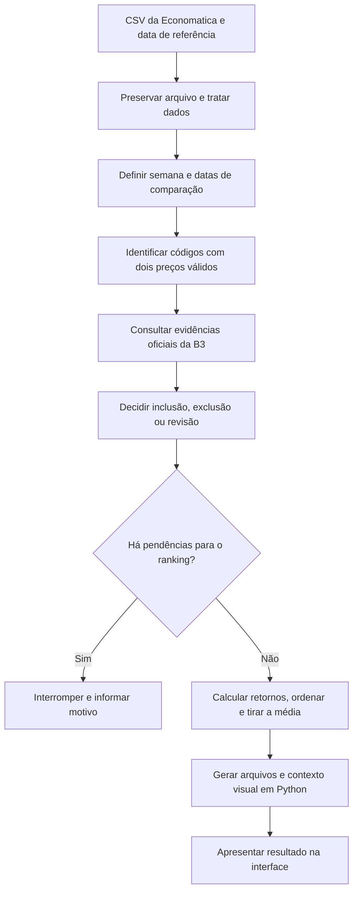

# Metodologia do ranking semanal

O ranking apresenta as 20 maiores variações de preço entre as ações ordinárias (ON) e preferenciais (PN) elegíveis na extração recebida. Os preços vêm da Economatica; a B3 fornece evidências para confirmar a espécie dos instrumentos.

Este artigo explica o comportamento atual do pipeline. O exemplo usa a execução de referência de **22/09/2026**. Outra extração terá suas próprias datas, ações, contagens e resultados.

## Nesta página

- [Da extração à apresentação](#da-extração-à-apresentação)
- [Qual semana é analisada](#qual-semana-é-analisada)
- [Quais ações entram](#quais-ações-entram)
- [Como o retorno é calculado](#como-o-retorno-é-calculado)
- [Como se formam o top 20 e a média](#como-se-formam-o-top-20-e-a-média)
- [Para que serve a janela alternativa](#para-que-serve-a-janela-alternativa)
- [Como interpretar os gráficos diários](#como-interpretar-os-gráficos-diários)
- [Quando o resultado é interrompido](#quando-o-resultado-é-interrompido)
- [Como conferir e reproduzir](#como-conferir-e-reproduzir)
- [Limites de interpretação](#limites-de-interpretação)

## Da extração à apresentação



Em palavras: o arquivo original é preservado; os dados são interpretados e validados; a semana é definida; as ações com dois preços utilizáveis são confirmadas; os retornos são calculados e ordenados; a interface apresenta os arquivos produzidos. Uma pendência relevante impede a publicação de um ranking aparentemente completo.

O tratamento inicial mantém todas as linhas rastreáveis. A seleção de elegíveis acontece depois. Preço ausente permanece ausente: não vira zero nem recebe o último preço conhecido.

Os retornos do ranking e os dados dos gráficos são produzidos em Python. O navegador apresenta os valores e permite explorar o resultado.

## Qual semana é analisada

A **data de referência** determina qual é a semana-calendário anterior, de segunda-feira a domingo. Ela não significa que todas as cotações daquele dia estarão disponíveis.

Para uma referência em 22/09/2026:

| Marco | Data | Papel |
| --- | --- | --- |
| Referência | 22/09/2026 | Define a semana anterior |
| Semana anterior | 14 a 20/09/2026 | Período que queremos analisar |
| Último fechamento antes da semana | 11/09/2026 | Preço inicial da janela principal |
| Primeiro fechamento na semana | 14/09/2026 | Preço inicial da janela alternativa |
| Último fechamento na semana | 18/09/2026 | Preço final das duas janelas |

### Janela principal: anterior à semana → último fechamento nela

O movimento do primeiro pregão é medido contra o fechamento anterior. Por isso, a comparação principal vai de **11/09 a 18/09**, embora a semana-calendário comece em 14/09.

Se começássemos pelo fechamento de segunda-feira, o movimento ocorrido durante a segunda já estaria incorporado ao preço inicial e ficaria fora da comparação.

As datas são escolhidas globalmente para a execução, com base nos dias da extração que possuem fechamentos positivos. Não usamos uma data inicial diferente para cada ação com preço faltante.

### Controles na seleção das datas

O sistema verifica se existe fechamento anterior e se há dados na semana. Também:

- Interrompe quando o último dia disponível é anterior à sexta-feira, até que a semana encurtada seja revisada e aceita explicitamente pelo formulário ou pelo comando `--allow-nonfriday-end`.
- Interrompe se o fechamento anterior estiver mais de dez dias antes da segunda-feira da semana.
- Compara a cobertura das três datas escolhidas com uma referência de cobertura recente: o valor central superior das contagens ordenadas de até dez datas anteriores com preços positivos. Uma ponta com menos da metade dessa cobertura impede o cálculo.
- Exige pelo menos duas datas com cotação dentro da semana para produzir a alternativa.

No formulário, a revisão mostra o fechamento anterior, o primeiro e o último dentro da semana, com suas contagens de linhas com fechamento positivo. O usuário precisa confirmar a aceitação antes de enfileirar uma semana encurtada. A confirmação vale apenas para aquele arquivo e referência, fica disponível na auditoria e no arquivo `analysis_request.json`, e é invalidada ao trocar a entrada. O pipeline verifica tudo novamente no worker.

Esses controles ajudam a detectar uma extração incompleta. O calendário e a cobertura observada não comprovam, sozinhos, que uma ausência é feriado.

## Quais ações entram

Uma ação precisa atender aos seguintes requisitos:

1. Ter fechamento positivo e utilizável nas duas datas da janela.
2. Ser identificada como ON ou PN pelas regras de código do projeto.
3. Ter confirmação oficial consistente da espécie nas duas datas de preço.
4. Passar pelas verificações de conflito e de qualidade aplicáveis aos preços usados.

O final do ticker indica uma hipótese de classe para códigos completos no padrão esperado. A confirmação da B3 é necessária para incluir ON/PN. Um código fora do padrão que tenha evidência oficial de ação exige revisão.

BDRs, units e outros instrumentos ficam fora da definição de universo adotada. A classificação detalhada de todo instrumento excluído não é requisito para o ranking; contradições oficiais e conflitos continuam sendo tratados como pendências. A lógica está em [ranking_universe.py](../ranking_universe.py).

Não há filtro de liquidez. O universo é formado pelas ações elegíveis da extração, portanto não representa necessariamente todas as ações da B3.

### Exemplo da execução de referência

| Etapa | Quantidade |
| --- | ---: |
| Códigos na extração | 478 |
| Sem duas pontas válidas | 158 |
| Com duas pontas válidas | 320 |
| Instrumentos fora do universo ON/PN | 12 |
| Ações elegíveis | 308 |
| Ações no ranking apresentado | 20 |

Os 158 códigos sem duas pontas não são perdas silenciosas: os motivos ficam registrados nas exclusões. Os 12 instrumentos com preços válidos, mas fora do universo, têm uma decisão distinta.

## Como o retorno é calculado

Usamos o **fechamento ajustado da Economatica** nas duas datas:

```text
Retorno = fechamento final ÷ fechamento inicial − 1
Retorno em porcentagem = retorno × 100
```

A B3 não substitui os preços da Economatica. Isso evita combinar séries de fontes e bases de ajuste diferentes.

### Exemplo real: ECOM3

| Informação | Valor |
| --- | ---: |
| Fechamento de 11/09/2026 | R$ 1,06 |
| Fechamento de 18/09/2026 | R$ 1,56 |
| Diferença de preço | R$ 0,50 |
| Retorno apresentado | 47,17% |

```text
1,56 ÷ 1,06 − 1 = 0,471698…
0,471698… × 100 = 47,169811…%
Exibição com duas casas = 47,17%
```

Dividimos pela base inicial porque queremos saber quanto o preço variou em relação ao valor do início. A diferença de R$ 0,50, sozinha, não permite comparar ações com preços diferentes.

O pipeline usa números decimais a partir dos valores recebidos. Não arredonda previamente os preços ou retornos para ordenar; divisões utilizam a precisão do cálculo decimal. A apresentação em duas casas não muda a posição calculada.

## Como se formam o top 20 e a média

Após calcular o retorno de cada ação elegível:

1. Ordenamos pelo retorno calculado, do maior para o menor.
2. Em empate desse valor, usamos o ticker em ordem crescente.
3. Selecionamos as primeiras 20 ações.
4. Somamos seus retornos e dividimos por 20.

```text
Média do top 20 = (retorno 1 + retorno 2 + … + retorno 20) ÷ 20
```

Cada ação tem o mesmo peso nessa média. Na referência, o valor calculado é aproximadamente **17,777107%**, apresentado como **17,78%**.

Essa é a média dos 20 maiores retornos selecionados após observar o período. Não é a média das 308 elegíveis, o retorno de um índice ou o resultado de uma estratégia executada antes da semana.

Se houver menos de 20 ações elegíveis, o programa interrompe a execução. Ele não entrega um top menor com o mesmo rótulo.

## Para que serve a janela alternativa

A alternativa compara o primeiro e o último fechamento **dentro da semana**: no exemplo, **14/09 a 18/09**.

Ela mostra a sensibilidade do resultado à interpretação do início da janela. Sua elegibilidade é avaliada novamente nas próprias pontas: uma ação pode ter preço em 11/09 e não ter em 14/09.

| Resultado da referência | Principal | Alternativa |
| --- | ---: | ---: |
| Pontas | 11 a 18/09/2026 | 14 a 18/09/2026 |
| Ações elegíveis | 308 | 302 |
| Média do top 20 | 17,78% | 15,93% |

Há 16 ações em comum nos dois top 20. A alternativa acompanha a análise; não substitui a regra principal.

## Como interpretar os gráficos diários

O preço diário mostra os fechamentos válidos observados. A variação diária compara duas datas consecutivas da extração:

```text
Variação diária = (fechamento atual ÷ fechamento anterior − 1) × 100
```

Se faltar um dos preços, a variação não é calculada. O sistema não pula a lacuna para apresentar uma variação de vários dias como diária. Datas consecutivas da extração podem estar separadas por vários dias de calendário; não há calendário oficial de pregões nessa construção visual.

Uma ação pode ter retorno semanal válido e células diárias vazias: basta possuir as duas pontas semanais e faltar um preço intermediário. Lacunas e preços conflitantes permanecem visíveis.

Somar percentuais diários não reproduz, em geral, o retorno semanal. Quando todas as comparações necessárias estão disponíveis, a conexão é multiplicativa: `(1 + r1) × (1 + r2) × … − 1`, com retornos em fração.

## Quando o resultado é interrompido

| Situação | Comportamento |
| --- | --- |
| Estrutura do arquivo incompatível | Erro descritivo; não adivinha o esquema |
| Ausência de uma ponta para um código | Exclusão registrada desse código |
| Semana sem dados suficientes ou cobertura de ponta insuficiente | Interrompe a seleção da janela |
| ON/PN candidata sem confirmação oficial nas duas datas | Pendência de classificação; impede o ranking |
| Conflito relevante de preço, espécie ou identificação | Exige revisão |
| Erro de qualidade no fechamento de uma ação elegível em uma ponta | Interrompe o cálculo |
| Menos de 20 ações elegíveis | Interrompe o ranking |
| Fonte B3 indisponível | Só continua se as fontes disponíveis forem suficientes; caso contrário informa a falha |

Nem toda ocorrência é bloqueadora. Um preço médio fora do intervalo mínimo–máximo é registrado; ele não é usado na fórmula e não prova que o fechamento esteja errado. Nenhuma ocorrência autoriza corrigir silenciosamente os preços.

## Como conferir e reproduzir

No resultado publicado, os downloads permitidos incluem:

| Arquivo | Como usar |
| --- | --- |
| `top20.csv` | Conferir posições, pontas, preços e retornos do principal |
| `all_returns.csv` | Conferir os retornos de todas as ações elegíveis |
| `top20_alternativo.csv` | Conferir o top da outra janela |
| `all_returns_alternativo.csv` | Conferir o universo de retornos da alternativa |
| `candidate_exclusions.csv` | Conferir códigos sem duas pontas válidas e motivos |
| `quality_context.json` | Ler as ocorrências relacionadas às datas usadas |
| `ranking_report.json` | Conferir datas, contagens, premissas, média e procedência |
| `README.md` | Ler o resumo da execução e as instruções de reprodução |

Na pasta completa gerada pelo comando Python, `classification/principal/ranking_universe.csv` registra as decisões de inclusão/exclusão de instrumentos com duas pontas. Esse arquivo não está atualmente na lista de downloads públicos. Os arquivos completos do tratamento também ficam nessa pasta, separados das saídas de ranking.

O relatório registra uma **assinatura do conteúdo do arquivo**, chamada hash SHA-256: ela permite verificar se dois arquivos têm o mesmo conteúdo. Essa assinatura identifica a entrada, mas não comprova que os dados estejam corretos. A procedência registra também a versão e a assinatura do código utilizado.

Para reproduzir com Python 3.11+ e o CSV original disponível, rode na raiz do repositório:

```powershell
python weekly_ranking.py --input "CAMINHO\economatica.csv" --reference-date 2026-09-22 --output-dir "runs\semana-2026-09-22"
```

A data do comando é a do exemplo; substitua pela referência da nova análise. Fontes oficiais podem ser obtidas durante a execução. Com todas as fontes necessárias já disponíveis no cache, `--offline` permite repetir o processamento sem acesso à rede.

Para conferir a implementação:

- [weekly_ranking.py](../weekly_ranking.py): seleção da semana, controles, ordenação, média e relatório.
- [ranking_universe.py](../ranking_universe.py): regras de inclusão, exclusão e revisão.
- [resolve_period.py](../resolve_period.py): obtenção e reaproveitamento de fontes oficiais.
- [etl.py](../etl.py): leitura, normalização e controles dos dados recebidos.
- [webapp/presentation.py](../webapp/presentation.py): dados apresentados e séries diárias.
- [Relatório da referência](../resultados/2026-09-22/ranking_report.json): números usados neste artigo.

## Limites de interpretação

- Os gráficos apresentam dados históricos da extração, não cotações em tempo real.
- “Ações em alta” descreve o universo elegível da análise, não todo o mercado.
- A variação é calculada sobre preços ajustados fornecidos pela Economatica. O projeto não valida integralmente todos os eventos que originaram esses ajustes nem acrescenta causas de movimentos.
- Não há filtro de liquidez, ponderação por tamanho, custos de transação ou simulação de execução de ordens.
- Uma nova extração é uma nova versão: preços ajustados podem ser revistos. Não anexamos cegamente os novos dados à execução anterior.
- A identificação completa de todo instrumento recebido é diferente da decisão de elegibilidade ON/PN. O ranking não promete catalogar todas as espécies financeiras.

## Revisão deste artigo

Preparado em **06/10/2026**, com base no código local correspondente à revisão `b9904a5` e nos arquivos da referência de 22/09/2026. Essa é uma identificação editorial da base consultada; não altera o registro da execução histórica.

Os artigos de [guia de uso](como-usar.md), [dados](dados.md), [classificação](classificacao.md) e [arquitetura](sistema.md) complementam esta explicação. Sempre que uma regra mudar, este artigo deve ser revisado junto com o código.
